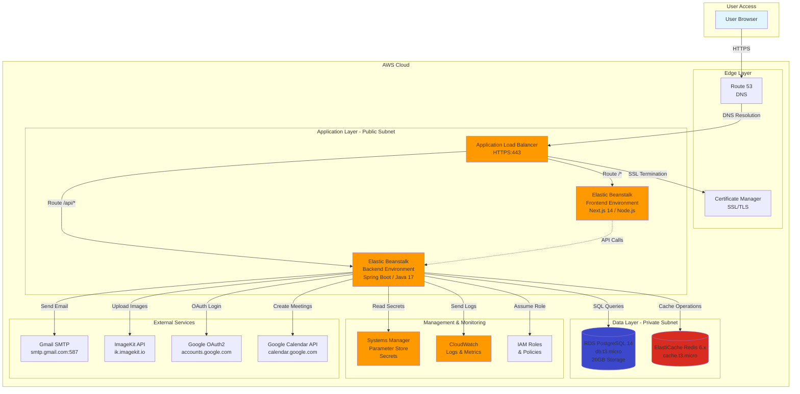

# Design Document: AWS Full-Stack Deployment

## Overview

This design document outlines the architecture and implementation strategy for deploying a full-stack task management application to AWS. The system consists of:

- **Frontend**: Next.js 14 application (React 18, TypeScript, Tailwind CSS)
- **Backend**: Spring Boot 3.3.5 REST API (Java 17)
- **Database**: PostgreSQL 14+ with Liquibase migrations
- **Cache**: Redis 6.x for session management
- **External Integrations**: Gmail SMTP, ImageKit, Google OAuth2, Google Calendar API

The deployment prioritizes cost-effectiveness (leveraging AWS free tier), security (HTTPS, network isolation), reliability (automated backups, health checks), and operational simplicity (managed services, infrastructure-as-code).

### Design Goals

1. **Cost-Effective**: Maximize use of AWS free tier resources
2. **Secure**: HTTPS everywhere, network isolation, secrets management
3. **Reliable**: Automated backups, health checks, auto-recovery
4. **Scalable**: Horizontal scaling for backend, CDN for frontend
5. **Maintainable**: Infrastructure-as-code, comprehensive monitoring
6. **Simple**: Managed services over self-managed infrastructure

## Architecture

### Deployment Option Analysis

Three deployment approaches were evaluated:

#### Option A: AWS Elastic Beanstalk (RECOMMENDED)
**Pros:**
- Simplest deployment model with managed infrastructure
- Built-in load balancing, auto-scaling, health monitoring
- Supports both frontend (Node.js) and backend (Java) platforms
- Free tier eligible (t3.micro instances)
- Integrated with RDS, ElastiCache, CloudWatch
- Zero-downtime deployments with rolling updates
- Easy rollback to previous versions

**Cons:**
- Less control over infrastructure details
- Limited customization compared to ECS/EC2
- Platform-specific configuration

**Cost Estimate (Monthly):**
- Elastic Beanstalk: $0 (service itself is free)
- EC2 t3.micro (2 instances): $0 (free tier: 750 hours/month)
- RDS db.t3.micro: $0 (free tier: 750 hours/month, 20GB storage)
- ElastiCache cache.t3.micro: ~$12 (no free tier)
- Data transfer: $0-5 (1GB free, then $0.09/GB)
- **Total: ~$12-17/month**

#### Option B: ECS Fargate
**Pros:**
- Containerized deployment with Docker
- Serverless compute (no EC2 management)
- Fine-grained resource allocation
- Better for microservices architecture

**Cons:**
- More complex setup (Docker images, task definitions)
- Higher cost (no free tier for Fargate)
- Requires container registry (ECR)
- Overkill for monolithic applications

**Cost Estimate (Monthly):**
- Fargate vCPU: ~$30 (0.25 vCPU × 730 hours × $0.04048)
- Fargate Memory: ~$7 (0.5GB × 730 hours × $0.004445)
- RDS db.t3.micro: $0 (free tier)
- ElastiCache: ~$12
- **Total: ~$49-54/month**

#### Option C: EC2 + S3/CloudFront
**Pros:**
- Maximum control and flexibility
- Can optimize costs with reserved instances
- Static frontend hosting on S3 is very cheap

**Cons:**
- Manual infrastructure management (OS patches, security)
- No built-in auto-scaling or load balancing
- Requires separate ALB setup (~$16/month)
- More operational overhead

**Cost Estimate (Monthly):**
- EC2 t3.micro: $0 (free tier)
- ALB: ~$16 (no free tier)
- S3 + CloudFront: ~$1-3
- RDS: $0 (free tier)
- ElastiCache: ~$12
- **Total: ~$29-31/month**

**RECOMMENDATION: Option A (Elastic Beanstalk)**

Elastic Beanstalk provides the best balance of simplicity, cost, and features for this application. It's ideal for teams that want to focus on application code rather than infrastructure management, while still providing production-grade capabilities.


### High-Level Architecture Diagram



### Network Topology

**VPC Configuration:**
- VPC CIDR: `10.0.0.0/16`
- Region: `us-east-1` (or user-preferred region)

**Subnets:**
- Public Subnet A: `10.0.1.0/24` (AZ: us-east-1a)
- Public Subnet B: `10.0.2.0/24` (AZ: us-east-1b)
- Private Subnet A: `10.0.11.0/24` (AZ: us-east-1a)
- Private Subnet B: `10.0.12.0/24` (AZ: us-east-1b)

**Security Groups:**

1. **ALB Security Group** (`alb-sg`)
   - Inbound: HTTPS (443) from 0.0.0.0/0
   - Inbound: HTTP (80) from 0.0.0.0/0 (redirect to HTTPS)
   - Outbound: All traffic

2. **Frontend Security Group** (`frontend-sg`)
   - Inbound: HTTP (80) from ALB Security Group
   - Outbound: HTTPS (443) to 0.0.0.0/0 (for API calls)

3. **Backend Security Group** (`backend-sg`)
   - Inbound: HTTP (8080) from ALB Security Group
   - Outbound: PostgreSQL (5432) to RDS Security Group
   - Outbound: Redis (6379) to ElastiCache Security Group
   - Outbound: HTTPS (443) to 0.0.0.0/0 (external APIs)
   - Outbound: SMTP (587) to 0.0.0.0/0 (Gmail)

4. **RDS Security Group** (`rds-sg`)
   - Inbound: PostgreSQL (5432) from Backend Security Group
   - Outbound: None

5. **ElastiCache Security Group** (`redis-sg`)
   - Inbound: Redis (6379) from Backend Security Group
   - Outbound: None

### Data Flow

**User Request Flow:**
1. User navigates to `https://app-name.elasticbeanstalk.com`
2. Route 53 resolves DNS to ALB
3. ALB terminates SSL using ACM certificate
4. ALB routes request based on path:
   - `/api/*` → Backend Elastic Beanstalk environment
   - `/*` → Frontend Elastic Beanstalk environment
5. Frontend serves Next.js pages (SSR or static)
6. Frontend makes API calls to backend via ALB
7. Backend processes request, queries RDS/Redis
8. Backend returns JSON response
9. Frontend renders UI with data

**Authentication Flow:**
1. User clicks "Login with Google"
2. Frontend redirects to backend OAuth endpoint
3. Backend redirects to Google OAuth consent screen
4. User authorizes, Google redirects back with code
5. Backend exchanges code for tokens
6. Backend creates user session in Redis
7. Backend generates JWT token
8. Frontend stores JWT in localStorage
9. Subsequent requests include JWT in Authorization header

**Email Notification Flow:**
1. Backend event triggers email (e.g., task assignment)
2. Backend retrieves Gmail credentials from Parameter Store
3. Backend connects to Gmail SMTP (smtp.gmail.com:587)
4. Backend sends email via SMTP
5. Gmail delivers email to recipient

**Image Upload Flow:**
1. User selects profile photo in frontend
2. Frontend uploads file to backend API
3. Backend retrieves ImageKit credentials from Parameter Store
4. Backend uploads image to ImageKit API
5. ImageKit returns image URL
6. Backend stores URL in PostgreSQL
7. Frontend displays image from ImageKit CDN


## Components and Interfaces

### Frontend Component (Next.js 14)

**Technology Stack:**
- Framework: Next.js 14.2.29
- Runtime: Node.js 18.x or 20.x
- Package Manager: npm
- UI Library: React 18
- Styling: Tailwind CSS
- State Management: Zustand

**Deployment Configuration:**
- Platform: Node.js (Elastic Beanstalk)
- Build Command: `npm run build`
- Start Command: `npm start`
- Port: 3000 (internal), 80 (ALB listener)
- Environment Variables:
  - `NEXT_PUBLIC_API_URL`: Backend API endpoint (e.g., `https://api.app-name.elasticbeanstalk.com`)
  - `NODE_ENV`: `production`

**Elastic Beanstalk Configuration:**
```yaml
# .ebextensions/01_nodecommands.config
option_settings:
  aws:elasticbeanstalk:container:nodejs:
    NodeCommand: "npm start"
    NodeVersion: 20.x
  aws:elasticbeanstalk:application:environment:
    NODE_ENV: production
    NEXT_PUBLIC_API_URL: https://api.app-name.elasticbeanstalk.com
```

**Build Artifacts:**
- `.next/` directory (Next.js build output)
- `node_modules/` (production dependencies)
- `package.json`, `package-lock.json`
- `next.config.mjs`

### Backend Component (Spring Boot 3.3.5)

**Technology Stack:**
- Framework: Spring Boot 3.3.5
- Runtime: Java 17 (Corretto)
- Build Tool: Maven 3.9+
- Database: PostgreSQL 14+ (via JDBC)
- Cache: Redis 6.x (via Lettuce)
- Migration: Liquibase

**Deployment Configuration:**
- Platform: Java 17 (Elastic Beanstalk)
- Build Command: `mvn clean package -DskipTests`
- Artifact: `target/backend-0.0.1-SNAPSHOT.jar`
- Port: 5000 (Elastic Beanstalk default for Java)
- JVM Options: `-Xmx512m -Xms256m`

**Elastic Beanstalk Configuration:**
```yaml
# .ebextensions/01_java.config
option_settings:
  aws:elasticbeanstalk:application:environment:
    SERVER_PORT: 5000
  aws:elasticbeanstalk:container:java:
    JVMOptions: "-Xmx512m -Xms256m"
```

**Environment Variables (from Parameter Store):**
- `DB_URL`: `jdbc:postgresql://<rds-endpoint>:5432/taskmanagement`
- `DB_USERNAME`: `postgres`
- `DB_PASSWORD`: `<secure-password>`
- `REDIS_HOST`: `<elasticache-endpoint>`
- `REDIS_PORT`: `6379`
- `MAIL_USERNAME`: `<gmail-address>`
- `MAIL_PASSWORD`: `<gmail-app-password>`
- `GOOGLE_CLIENT_ID`: `<oauth-client-id>`
- `GOOGLE_CLIENT_SECRET`: `<oauth-client-secret>`
- `IMAGEKIT_PUBLIC_KEY`: `<imagekit-public-key>`
- `IMAGEKIT_PRIVATE_KEY`: `<imagekit-private-key>`
- `IMAGEKIT_URL_ENDPOINT`: `https://ik.imagekit.io/rx5x7e5fu`
- `GOOGLE_CALENDAR_ENABLED`: `false` (or `true` if configured)
- `GOOGLE_CALENDAR_CREDENTIALS_FILE`: `/var/app/current/config/google-credentials.json`

**Health Check Endpoint:**
- Path: `/actuator/health`
- Expected Response: `{"status":"UP"}`
- Checks: Database connectivity, Redis connectivity

**API Endpoints:**
- Authentication: `/api/auth/*`
- Users: `/api/users/*`
- Tasks: `/api/tasks/*`
- Projects: `/api/projects/*`
- Activity Logs: `/api/activity-logs/*`

### Database Component (RDS PostgreSQL)

**Configuration:**
- Engine: PostgreSQL 14.x
- Instance Class: `db.t3.micro` (free tier: 750 hours/month)
- Storage: 20GB GP2 (free tier: 20GB)
- Multi-AZ: Disabled (to stay in free tier)
- Backup Retention: 7 days
- Backup Window: 03:00-04:00 UTC
- Maintenance Window: Sun 04:00-05:00 UTC
- Encryption: Enabled (at rest)
- Public Accessibility: No (private subnet only)

**Connection Details:**
- Port: 5432
- Database Name: `taskmanagement`
- Master Username: `postgres`
- Master Password: Stored in Parameter Store
- Endpoint: `<db-instance-id>.<region>.rds.amazonaws.com`

**Schema Management:**
- Liquibase changesets in `src/main/resources/db/changelog/`
- Automatic migration on application startup
- Changelog master file: `db.changelog-master.xml`

### Cache Component (ElastiCache Redis)

**Configuration:**
- Engine: Redis 6.x
- Node Type: `cache.t3.micro` (~$12/month, no free tier)
- Number of Nodes: 1 (single node for cost optimization)
- Automatic Failover: Disabled (single node)
- Backup Retention: 1 day
- Backup Window: 04:00-05:00 UTC
- Encryption: Enabled (at rest and in transit)
- Public Accessibility: No (private subnet only)

**Connection Details:**
- Port: 6379
- Endpoint: `<cache-cluster-id>.<region>.cache.amazonaws.com`
- Auth Token: Optional (can use for additional security)

**Usage Patterns:**
- Session storage (Spring Session)
- API response caching
- Rate limiting data
- Temporary data (OTP codes, reset tokens)

### Load Balancer Component (ALB)

**Configuration:**
- Type: Application Load Balancer
- Scheme: Internet-facing
- IP Address Type: IPv4
- Subnets: Public Subnet A, Public Subnet B
- Security Group: `alb-sg`

**Listeners:**
1. HTTP Listener (Port 80)
   - Action: Redirect to HTTPS (Port 443)

2. HTTPS Listener (Port 443)
   - SSL Certificate: From ACM
   - Rules:
     - Path `/api/*` → Backend Target Group
     - Path `/*` → Frontend Target Group

**Target Groups:**
1. Backend Target Group
   - Protocol: HTTP
   - Port: 5000
   - Health Check: `/actuator/health`
   - Health Check Interval: 30 seconds
   - Healthy Threshold: 2
   - Unhealthy Threshold: 2
   - Timeout: 5 seconds
   - Stickiness: Enabled (1 hour)

2. Frontend Target Group
   - Protocol: HTTP
   - Port: 80
   - Health Check: `/`
   - Health Check Interval: 30 seconds
   - Healthy Threshold: 2
   - Unhealthy Threshold: 2
   - Timeout: 5 seconds

### Secrets Management (Systems Manager Parameter Store)

**Parameter Hierarchy:**
```
/taskmanagement/prod/db/url
/taskmanagement/prod/db/username
/taskmanagement/prod/db/password (SecureString)
/taskmanagement/prod/redis/host
/taskmanagement/prod/redis/port
/taskmanagement/prod/mail/username
/taskmanagement/prod/mail/password (SecureString)
/taskmanagement/prod/google/client-id
/taskmanagement/prod/google/client-secret (SecureString)
/taskmanagement/prod/imagekit/public-key
/taskmanagement/prod/imagekit/private-key (SecureString)
/taskmanagement/prod/imagekit/url-endpoint
```

**Access Pattern:**
- Elastic Beanstalk environment variables reference Parameter Store
- IAM role attached to EC2 instances grants `ssm:GetParameter` permission
- Parameters are injected as environment variables at instance startup

**Example Configuration:**
```yaml
# .ebextensions/02_parameters.config
option_settings:
  aws:elasticbeanstalk:application:environment:
    DB_URL: '`{"Ref": "AWSEBParameterStoreDBUrl"}`'
    DB_PASSWORD: '`{"Ref": "AWSEBParameterStoreDBPassword"}`'
```


## Data Models

### Infrastructure Resources

**VPC Resource:**
```typescript
interface VPCResource {
  vpcId: string;
  cidrBlock: string; // "10.0.0.0/16"
  enableDnsHostnames: boolean; // true
  enableDnsSupport: boolean; // true
  tags: {
    Name: string; // "taskmanagement-vpc"
    Environment: string; // "production"
  };
}
```

**Subnet Resource:**
```typescript
interface SubnetResource {
  subnetId: string;
  vpcId: string;
  cidrBlock: string; // e.g., "10.0.1.0/24"
  availabilityZone: string; // e.g., "us-east-1a"
  mapPublicIpOnLaunch: boolean; // true for public, false for private
  tags: {
    Name: string; // e.g., "taskmanagement-public-subnet-a"
    Type: "public" | "private";
  };
}
```

**Security Group Resource:**
```typescript
interface SecurityGroupResource {
  groupId: string;
  groupName: string;
  description: string;
  vpcId: string;
  ingressRules: SecurityGroupRule[];
  egressRules: SecurityGroupRule[];
}

interface SecurityGroupRule {
  protocol: "tcp" | "udp" | "icmp" | "-1"; // -1 = all
  fromPort: number;
  toPort: number;
  source: string | SecurityGroupResource; // CIDR or security group ID
  description: string;
}
```

**RDS Instance Resource:**
```typescript
interface RDSInstanceResource {
  dbInstanceIdentifier: string;
  engine: "postgres";
  engineVersion: string; // "14.x"
  instanceClass: string; // "db.t3.micro"
  allocatedStorage: number; // 20 (GB)
  storageType: "gp2" | "gp3";
  dbName: string; // "taskmanagement"
  masterUsername: string;
  masterPassword: string; // from Parameter Store
  vpcSecurityGroupIds: string[];
  dbSubnetGroupName: string;
  backupRetentionPeriod: number; // 7 days
  preferredBackupWindow: string; // "03:00-04:00"
  preferredMaintenanceWindow: string; // "sun:04:00-sun:05:00"
  multiAZ: boolean; // false for free tier
  publiclyAccessible: boolean; // false
  storageEncrypted: boolean; // true
}
```

**ElastiCache Cluster Resource:**
```typescript
interface ElastiCacheClusterResource {
  cacheClusterId: string;
  engine: "redis";
  engineVersion: string; // "6.x"
  cacheNodeType: string; // "cache.t3.micro"
  numCacheNodes: number; // 1
  port: number; // 6379
  vpcSecurityGroupIds: string[];
  cacheSubnetGroupName: string;
  snapshotRetentionLimit: number; // 1 day
  preferredMaintenanceWindow: string; // "sun:05:00-sun:06:00"
  atRestEncryptionEnabled: boolean; // true
  transitEncryptionEnabled: boolean; // true
}
```

**Elastic Beanstalk Application:**
```typescript
interface ElasticBeanstalkApplication {
  applicationName: string; // "taskmanagement"
  description: string;
  environments: ElasticBeanstalkEnvironment[];
}

interface ElasticBeanstalkEnvironment {
  environmentName: string; // "taskmanagement-frontend-prod"
  applicationName: string;
  solutionStackName: string; // e.g., "64bit Amazon Linux 2023 v6.1.0 running Node.js 20"
  tier: {
    name: "WebServer";
    type: "Standard";
  };
  optionSettings: EnvironmentOptionSetting[];
  versionLabel: string;
}

interface EnvironmentOptionSetting {
  namespace: string; // e.g., "aws:elasticbeanstalk:application:environment"
  optionName: string; // e.g., "NODE_ENV"
  value: string; // e.g., "production"
}
```

**Application Load Balancer:**
```typescript
interface LoadBalancerResource {
  loadBalancerArn: string;
  loadBalancerName: string;
  scheme: "internet-facing" | "internal";
  type: "application";
  ipAddressType: "ipv4";
  subnets: string[]; // public subnet IDs
  securityGroups: string[];
  listeners: LoadBalancerListener[];
}

interface LoadBalancerListener {
  listenerArn: string;
  protocol: "HTTP" | "HTTPS";
  port: number;
  defaultActions: ListenerAction[];
  certificates?: CertificateReference[];
}

interface ListenerAction {
  type: "forward" | "redirect" | "fixed-response";
  targetGroupArn?: string;
  redirectConfig?: {
    protocol: "HTTPS";
    port: "443";
    statusCode: "HTTP_301";
  };
}
```

### Configuration Models

**Database Connection Configuration:**
```java
@Configuration
public class DatabaseConfig {
    @Value("${DB_URL}")
    private String dbUrl;
    
    @Value("${DB_USERNAME}")
    private String dbUsername;
    
    @Value("${DB_PASSWORD}")
    private String dbPassword;
    
    @Bean
    public DataSource dataSource() {
        HikariConfig config = new HikariConfig();
        config.setJdbcUrl(dbUrl);
        config.setUsername(dbUsername);
        config.setPassword(dbPassword);
        config.setMaximumPoolSize(10);
        config.setMinimumIdle(2);
        config.setConnectionTimeout(30000);
        return new HikariDataSource(config);
    }
}
```

**Redis Connection Configuration:**
```java
@Configuration
@EnableRedisRepositories
public class RedisConfig {
    @Value("${REDIS_HOST}")
    private String redisHost;
    
    @Value("${REDIS_PORT}")
    private int redisPort;
    
    @Bean
    public LettuceConnectionFactory redisConnectionFactory() {
        RedisStandaloneConfiguration config = new RedisStandaloneConfiguration();
        config.setHostName(redisHost);
        config.setPort(redisPort);
        
        LettuceClientConfiguration clientConfig = LettuceClientConfiguration.builder()
            .commandTimeout(Duration.ofSeconds(2))
            .build();
            
        return new LettuceConnectionFactory(config, clientConfig);
    }
}
```

**CORS Configuration:**
```java
@Configuration
public class CorsConfig implements WebMvcConfigurer {
    @Value("${FRONTEND_URL:https://taskmanagement-frontend.elasticbeanstalk.com}")
    private String frontendUrl;
    
    @Override
    public void addCorsMappings(CorsRegistry registry) {
        registry.addMapping("/api/**")
            .allowedOrigins(frontendUrl)
            .allowedMethods("GET", "POST", "PUT", "DELETE", "PATCH", "OPTIONS")
            .allowedHeaders("*")
            .allowCredentials(true)
            .maxAge(3600);
    }
}
```


## Deployment Strategy

### Prerequisites

**Local Development Environment:**
- AWS CLI v2 installed and configured
- EB CLI (Elastic Beanstalk CLI) installed
- Java 17 JDK
- Node.js 18+ and npm
- Maven 3.9+
- Git

**AWS Account Setup:**
- AWS account with free tier eligibility
- IAM user with permissions:
  - ElasticBeanstalk full access
  - RDS full access
  - ElastiCache full access
  - VPC full access
  - EC2 full access
  - Systems Manager Parameter Store access
  - CloudWatch Logs access
  - Certificate Manager access
  - Route 53 (if using custom domain)

### Step-by-Step Deployment Process

#### Phase 1: Infrastructure Setup

**1.1 Create VPC and Networking**

```bash
# Create VPC
aws ec2 create-vpc \
  --cidr-block 10.0.0.0/16 \
  --tag-specifications 'ResourceType=vpc,Tags=[{Key=Name,Value=taskmanagement-vpc}]'

# Enable DNS hostnames
aws ec2 modify-vpc-attribute \
  --vpc-id <vpc-id> \
  --enable-dns-hostnames

# Create Internet Gateway
aws ec2 create-internet-gateway \
  --tag-specifications 'ResourceType=internet-gateway,Tags=[{Key=Name,Value=taskmanagement-igw}]'

# Attach Internet Gateway to VPC
aws ec2 attach-internet-gateway \
  --vpc-id <vpc-id> \
  --internet-gateway-id <igw-id>

# Create Public Subnets
aws ec2 create-subnet \
  --vpc-id <vpc-id> \
  --cidr-block 10.0.1.0/24 \
  --availability-zone us-east-1a \
  --tag-specifications 'ResourceType=subnet,Tags=[{Key=Name,Value=taskmanagement-public-subnet-a}]'

aws ec2 create-subnet \
  --vpc-id <vpc-id> \
  --cidr-block 10.0.2.0/24 \
  --availability-zone us-east-1b \
  --tag-specifications 'ResourceType=subnet,Tags=[{Key=Name,Value=taskmanagement-public-subnet-b}]'

# Create Private Subnets
aws ec2 create-subnet \
  --vpc-id <vpc-id> \
  --cidr-block 10.0.11.0/24 \
  --availability-zone us-east-1a \
  --tag-specifications 'ResourceType=subnet,Tags=[{Key=Name,Value=taskmanagement-private-subnet-a}]'

aws ec2 create-subnet \
  --vpc-id <vpc-id> \
  --cidr-block 10.0.12.0/24 \
  --availability-zone us-east-1b \
  --tag-specifications 'ResourceType=subnet,Tags=[{Key=Name,Value=taskmanagement-private-subnet-b}]'

# Create Route Table for Public Subnets
aws ec2 create-route-table \
  --vpc-id <vpc-id> \
  --tag-specifications 'ResourceType=route-table,Tags=[{Key=Name,Value=taskmanagement-public-rt}]'

# Add route to Internet Gateway
aws ec2 create-route \
  --route-table-id <rt-id> \
  --destination-cidr-block 0.0.0.0/0 \
  --gateway-id <igw-id>

# Associate public subnets with route table
aws ec2 associate-route-table \
  --subnet-id <public-subnet-a-id> \
  --route-table-id <rt-id>

aws ec2 associate-route-table \
  --subnet-id <public-subnet-b-id> \
  --route-table-id <rt-id>
```

**1.2 Create Security Groups**

```bash
# ALB Security Group
aws ec2 create-security-group \
  --group-name taskmanagement-alb-sg \
  --description "Security group for Application Load Balancer" \
  --vpc-id <vpc-id>

aws ec2 authorize-security-group-ingress \
  --group-id <alb-sg-id> \
  --protocol tcp \
  --port 443 \
  --cidr 0.0.0.0/0

aws ec2 authorize-security-group-ingress \
  --group-id <alb-sg-id> \
  --protocol tcp \
  --port 80 \
  --cidr 0.0.0.0/0

# Backend Security Group
aws ec2 create-security-group \
  --group-name taskmanagement-backend-sg \
  --description "Security group for Backend API" \
  --vpc-id <vpc-id>

aws ec2 authorize-security-group-ingress \
  --group-id <backend-sg-id> \
  --protocol tcp \
  --port 5000 \
  --source-group <alb-sg-id>

# RDS Security Group
aws ec2 create-security-group \
  --group-name taskmanagement-rds-sg \
  --description "Security group for RDS PostgreSQL" \
  --vpc-id <vpc-id>

aws ec2 authorize-security-group-ingress \
  --group-id <rds-sg-id> \
  --protocol tcp \
  --port 5432 \
  --source-group <backend-sg-id>

# ElastiCache Security Group
aws ec2 create-security-group \
  --group-name taskmanagement-redis-sg \
  --description "Security group for ElastiCache Redis" \
  --vpc-id <vpc-id>

aws ec2 authorize-security-group-ingress \
  --group-id <redis-sg-id> \
  --protocol tcp \
  --port 6379 \
  --source-group <backend-sg-id>
```

**1.3 Create RDS PostgreSQL Database**

```bash
# Create DB Subnet Group
aws rds create-db-subnet-group \
  --db-subnet-group-name taskmanagement-db-subnet-group \
  --db-subnet-group-description "Subnet group for RDS" \
  --subnet-ids <private-subnet-a-id> <private-subnet-b-id>

# Create RDS Instance
aws rds create-db-instance \
  --db-instance-identifier taskmanagement-db \
  --db-instance-class db.t3.micro \
  --engine postgres \
  --engine-version 14.10 \
  --master-username postgres \
  --master-user-password <secure-password> \
  --allocated-storage 20 \
  --storage-type gp2 \
  --db-name taskmanagement \
  --vpc-security-group-ids <rds-sg-id> \
  --db-subnet-group-name taskmanagement-db-subnet-group \
  --backup-retention-period 7 \
  --preferred-backup-window "03:00-04:00" \
  --preferred-maintenance-window "sun:04:00-sun:05:00" \
  --no-multi-az \
  --no-publicly-accessible \
  --storage-encrypted

# Wait for RDS instance to be available (takes ~10 minutes)
aws rds wait db-instance-available \
  --db-instance-identifier taskmanagement-db

# Get RDS endpoint
aws rds describe-db-instances \
  --db-instance-identifier taskmanagement-db \
  --query 'DBInstances[0].Endpoint.Address' \
  --output text
```

**1.4 Create ElastiCache Redis Cluster**

```bash
# Create Cache Subnet Group
aws elasticache create-cache-subnet-group \
  --cache-subnet-group-name taskmanagement-cache-subnet-group \
  --cache-subnet-group-description "Subnet group for ElastiCache" \
  --subnet-ids <private-subnet-a-id> <private-subnet-b-id>

# Create Redis Cluster
aws elasticache create-cache-cluster \
  --cache-cluster-id taskmanagement-redis \
  --cache-node-type cache.t3.micro \
  --engine redis \
  --engine-version 6.2 \
  --num-cache-nodes 1 \
  --port 6379 \
  --security-group-ids <redis-sg-id> \
  --cache-subnet-group-name taskmanagement-cache-subnet-group \
  --snapshot-retention-limit 1 \
  --preferred-maintenance-window "sun:05:00-sun:06:00"

# Wait for cache cluster to be available (takes ~5 minutes)
aws elasticache wait cache-cluster-available \
  --cache-cluster-id taskmanagement-redis

# Get Redis endpoint
aws elasticache describe-cache-clusters \
  --cache-cluster-id taskmanagement-redis \
  --show-cache-node-info \
  --query 'CacheClusters[0].CacheNodes[0].Endpoint.Address' \
  --output text
```

**1.5 Store Secrets in Parameter Store**

```bash
# Database credentials
aws ssm put-parameter \
  --name /taskmanagement/prod/db/url \
  --value "jdbc:postgresql://<rds-endpoint>:5432/taskmanagement" \
  --type String

aws ssm put-parameter \
  --name /taskmanagement/prod/db/username \
  --value "postgres" \
  --type String

aws ssm put-parameter \
  --name /taskmanagement/prod/db/password \
  --value "<secure-password>" \
  --type SecureString

# Redis configuration
aws ssm put-parameter \
  --name /taskmanagement/prod/redis/host \
  --value "<redis-endpoint>" \
  --type String

aws ssm put-parameter \
  --name /taskmanagement/prod/redis/port \
  --value "6379" \
  --type String

# Gmail SMTP credentials
aws ssm put-parameter \
  --name /taskmanagement/prod/mail/username \
  --value "<gmail-address>" \
  --type String

aws ssm put-parameter \
  --name /taskmanagement/prod/mail/password \
  --value "<gmail-app-password>" \
  --type SecureString

# Google OAuth2 credentials
aws ssm put-parameter \
  --name /taskmanagement/prod/google/client-id \
  --value "<oauth-client-id>" \
  --type String

aws ssm put-parameter \
  --name /taskmanagement/prod/google/client-secret \
  --value "<oauth-client-secret>" \
  --type SecureString

# ImageKit credentials
aws ssm put-parameter \
  --name /taskmanagement/prod/imagekit/public-key \
  --value "<imagekit-public-key>" \
  --type String

aws ssm put-parameter \
  --name /taskmanagement/prod/imagekit/private-key \
  --value "<imagekit-private-key>" \
  --type SecureString

aws ssm put-parameter \
  --name /taskmanagement/prod/imagekit/url-endpoint \
  --value "https://ik.imagekit.io/rx5x7e5fu" \
  --type String
```

#### Phase 2: Backend Deployment

**2.1 Prepare Backend Application**

```bash
cd Backend_Java/backend/backend

# Create .ebextensions directory for Elastic Beanstalk configuration
mkdir -p .ebextensions

# Create Java configuration file
cat > .ebextensions/01_java.config << 'EOF'
option_settings:
  aws:elasticbeanstalk:application:environment:
    SERVER_PORT: 5000
  aws:elasticbeanstalk:container:java:
    JVMOptions: "-Xmx512m -Xms256m"
EOF

# Create environment variables configuration
cat > .ebextensions/02_environment.config << 'EOF'
option_settings:
  aws:elasticbeanstalk:application:environment:
    DB_URL: '`{"Fn::Sub": "{{resolve:ssm:/taskmanagement/prod/db/url}}"}`'
    DB_USERNAME: '`{"Fn::Sub": "{{resolve:ssm:/taskmanagement/prod/db/username}}"}`'
    DB_PASSWORD: '`{"Fn::Sub": "{{resolve:ssm-secure:/taskmanagement/prod/db/password}}"}`'
    REDIS_HOST: '`{"Fn::Sub": "{{resolve:ssm:/taskmanagement/prod/redis/host}}"}`'
    REDIS_PORT: '`{"Fn::Sub": "{{resolve:ssm:/taskmanagement/prod/redis/port}}"}`'
    MAIL_USERNAME: '`{"Fn::Sub": "{{resolve:ssm:/taskmanagement/prod/mail/username}}"}`'
    MAIL_PASSWORD: '`{"Fn::Sub": "{{resolve:ssm-secure:/taskmanagement/prod/mail/password}}"}`'
    GOOGLE_CLIENT_ID: '`{"Fn::Sub": "{{resolve:ssm:/taskmanagement/prod/google/client-id}}"}`'
    GOOGLE_CLIENT_SECRET: '`{"Fn::Sub": "{{resolve:ssm-secure:/taskmanagement/prod/google/client-secret}}"}`'
    IMAGEKIT_PUBLIC_KEY: '`{"Fn::Sub": "{{resolve:ssm:/taskmanagement/prod/imagekit/public-key}}"}`'
    IMAGEKIT_PRIVATE_KEY: '`{"Fn::Sub": "{{resolve:ssm-secure:/taskmanagement/prod/imagekit/private-key}}"}`'
    IMAGEKIT_URL_ENDPOINT: '`{"Fn::Sub": "{{resolve:ssm:/taskmanagement/prod/imagekit/url-endpoint}}"}`'
    GOOGLE_CALENDAR_ENABLED: false
EOF

# Build the application
mvn clean package -DskipTests

# Verify JAR was created
ls -lh target/backend-0.0.1-SNAPSHOT.jar
```

**2.2 Initialize Elastic Beanstalk for Backend**

```bash
# Initialize EB CLI
eb init -p java-17 taskmanagement-backend --region us-east-1

# Create Elastic Beanstalk environment
eb create taskmanagement-backend-prod \
  --instance-type t3.micro \
  --vpc.id <vpc-id> \
  --vpc.ec2subnets <public-subnet-a-id>,<public-subnet-b-id> \
  --vpc.elbsubnets <public-subnet-a-id>,<public-subnet-b-id> \
  --vpc.securitygroups <backend-sg-id> \
  --vpc.publicip \
  --envvars SERVER_PORT=5000

# Deploy the application
eb deploy

# Check environment status
eb status

# View logs
eb logs
```

**2.3 Configure Health Checks**

```bash
# Update health check path
aws elasticbeanstalk update-environment \
  --environment-name taskmanagement-backend-prod \
  --option-settings \
    Namespace=aws:elasticbeanstalk:application,OptionName=Application\ Healthcheck\ URL,Value=/actuator/health
```

#### Phase 3: Frontend Deployment

**3.1 Prepare Frontend Application**

```bash
cd Nextjs_Frontend

# Create .ebextensions directory
mkdir -p .ebextensions

# Create Node.js configuration
cat > .ebextensions/01_nodecommands.config << 'EOF'
option_settings:
  aws:elasticbeanstalk:container:nodejs:
    NodeCommand: "npm start"
    NodeVersion: 20.x
  aws:elasticbeanstalk:application:environment:
    NODE_ENV: production
    NEXT_PUBLIC_API_URL: https://<backend-eb-url>
EOF

# Build the application
npm install
npm run build

# Create deployment package
zip -r frontend-deploy.zip .next node_modules package.json package-lock.json next.config.mjs .ebextensions
```

**3.2 Initialize Elastic Beanstalk for Frontend**

```bash
# Initialize EB CLI
eb init -p node.js-20 taskmanagement-frontend --region us-east-1

# Create Elastic Beanstalk environment
eb create taskmanagement-frontend-prod \
  --instance-type t3.micro \
  --vpc.id <vpc-id> \
  --vpc.ec2subnets <public-subnet-a-id>,<public-subnet-b-id> \
  --vpc.elbsubnets <public-subnet-a-id>,<public-subnet-b-id> \
  --vpc.publicip

# Deploy the application
eb deploy

# Check environment status
eb status

# Get environment URL
eb status | grep CNAME
```

#### Phase 4: SSL/TLS Configuration

**4.1 Request SSL Certificate**

```bash
# Request certificate from ACM
aws acm request-certificate \
  --domain-name taskmanagement.example.com \
  --subject-alternative-names www.taskmanagement.example.com \
  --validation-method DNS \
  --region us-east-1

# Get certificate ARN
aws acm list-certificates --region us-east-1
```

**4.2 Configure HTTPS Listener**

```bash
# Add HTTPS listener to Elastic Beanstalk load balancer
aws elasticbeanstalk update-environment \
  --environment-name taskmanagement-frontend-prod \
  --option-settings \
    Namespace=aws:elbv2:listener:443,OptionName=Protocol,Value=HTTPS \
    Namespace=aws:elbv2:listener:443,OptionName=SSLCertificateArns,Value=<certificate-arn>
```

#### Phase 5: Monitoring and Logging

**5.1 Configure CloudWatch Logs**

```bash
# Enable CloudWatch Logs streaming for backend
aws elasticbeanstalk update-environment \
  --environment-name taskmanagement-backend-prod \
  --option-settings \
    Namespace=aws:elasticbeanstalk:cloudwatch:logs,OptionName=StreamLogs,Value=true \
    Namespace=aws:elasticbeanstalk:cloudwatch:logs,OptionName=DeleteOnTerminate,Value=false \
    Namespace=aws:elasticbeanstalk:cloudwatch:logs,OptionName=RetentionInDays,Value=7

# Enable CloudWatch Logs streaming for frontend
aws elasticbeanstalk update-environment \
  --environment-name taskmanagement-frontend-prod \
  --option-settings \
    Namespace=aws:elasticbeanstalk:cloudwatch:logs,OptionName=StreamLogs,Value=true \
    Namespace=aws:elasticbeanstalk:cloudwatch:logs,OptionName=DeleteOnTerminate,Value=false \
    Namespace=aws:elasticbeanstalk:cloudwatch:logs,OptionName=RetentionInDays,Value=7
```

**5.2 Create CloudWatch Alarms**

```bash
# CPU utilization alarm
aws cloudwatch put-metric-alarm \
  --alarm-name taskmanagement-backend-high-cpu \
  --alarm-description "Alert when CPU exceeds 80%" \
  --metric-name CPUUtilization \
  --namespace AWS/EC2 \
  --statistic Average \
  --period 300 \
  --threshold 80 \
  --comparison-operator GreaterThanThreshold \
  --evaluation-periods 2

# Database connection alarm
aws cloudwatch put-metric-alarm \
  --alarm-name taskmanagement-db-connections \
  --alarm-description "Alert when DB connections exceed 80" \
  --metric-name DatabaseConnections \
  --namespace AWS/RDS \
  --statistic Average \
  --period 300 \
  --threshold 80 \
  --comparison-operator GreaterThanThreshold \
  --evaluation-periods 1
```


### Infrastructure-as-Code Approach

For production deployments, manual AWS CLI commands should be replaced with Infrastructure-as-Code (IaC) tools. Below are examples using AWS CDK (TypeScript), which is recommended for its type safety and AWS integration.

**AWS CDK Stack Example:**

```typescript
// lib/taskmanagement-stack.ts
import * as cdk from 'aws-cdk-lib';
import * as ec2 from 'aws-cdk-lib/aws-ec2';
import * as rds from 'aws-cdk-lib/aws-rds';
import * as elasticache from 'aws-cdk-lib/aws-elasticache';
import * as elasticbeanstalk from 'aws-cdk-lib/aws-elasticbeanstalk';
import * as iam from 'aws-cdk-lib/aws-iam';
import * as ssm from 'aws-cdk-lib/aws-ssm';
import { Construct } from 'constructs';

export class TaskManagementStack extends cdk.Stack {
  constructor(scope: Construct, id: string, props?: cdk.StackProps) {
    super(scope, id, props);

    // VPC
    const vpc = new ec2.Vpc(this, 'TaskManagementVPC', {
      cidr: '10.0.0.0/16',
      maxAzs: 2,
      natGateways: 0, // No NAT Gateway to save costs
      subnetConfiguration: [
        {
          name: 'Public',
          subnetType: ec2.SubnetType.PUBLIC,
          cidrMask: 24,
        },
        {
          name: 'Private',
          subnetType: ec2.SubnetType.PRIVATE_ISOLATED,
          cidrMask: 24,
        },
      ],
    });

    // Security Groups
    const albSecurityGroup = new ec2.SecurityGroup(this, 'ALBSecurityGroup', {
      vpc,
      description: 'Security group for Application Load Balancer',
      allowAllOutbound: true,
    });
    albSecurityGroup.addIngressRule(ec2.Peer.anyIpv4(), ec2.Port.tcp(443), 'Allow HTTPS');
    albSecurityGroup.addIngressRule(ec2.Peer.anyIpv4(), ec2.Port.tcp(80), 'Allow HTTP');

    const backendSecurityGroup = new ec2.SecurityGroup(this, 'BackendSecurityGroup', {
      vpc,
      description: 'Security group for Backend API',
      allowAllOutbound: true,
    });
    backendSecurityGroup.addIngressRule(albSecurityGroup, ec2.Port.tcp(5000), 'Allow from ALB');

    const rdsSecurityGroup = new ec2.SecurityGroup(this, 'RDSSecurityGroup', {
      vpc,
      description: 'Security group for RDS PostgreSQL',
      allowAllOutbound: false,
    });
    rdsSecurityGroup.addIngressRule(backendSecurityGroup, ec2.Port.tcp(5432), 'Allow from Backend');

    const redisSecurityGroup = new ec2.SecurityGroup(this, 'RedisSecurityGroup', {
      vpc,
      description: 'Security group for ElastiCache Redis',
      allowAllOutbound: false,
    });
    redisSecurityGroup.addIngressRule(backendSecurityGroup, ec2.Port.tcp(6379), 'Allow from Backend');

    // RDS PostgreSQL
    const dbInstance = new rds.DatabaseInstance(this, 'TaskManagementDB', {
      engine: rds.DatabaseInstanceEngine.postgres({
        version: rds.PostgresEngineVersion.VER_14,
      }),
      instanceType: ec2.InstanceType.of(ec2.InstanceClass.T3, ec2.InstanceSize.MICRO),
      vpc,
      vpcSubnets: { subnetType: ec2.SubnetType.PRIVATE_ISOLATED },
      securityGroups: [rdsSecurityGroup],
      databaseName: 'taskmanagement',
      credentials: rds.Credentials.fromGeneratedSecret('postgres'),
      allocatedStorage: 20,
      storageType: rds.StorageType.GP2,
      backupRetention: cdk.Duration.days(7),
      deleteAutomatedBackups: true,
      removalPolicy: cdk.RemovalPolicy.SNAPSHOT,
      storageEncrypted: true,
      multiAz: false, // Single AZ for free tier
    });

    // ElastiCache Redis
    const redisSubnetGroup = new elasticache.CfnSubnetGroup(this, 'RedisSubnetGroup', {
      description: 'Subnet group for ElastiCache Redis',
      subnetIds: vpc.selectSubnets({ subnetType: ec2.SubnetType.PRIVATE_ISOLATED }).subnetIds,
    });

    const redisCluster = new elasticache.CfnCacheCluster(this, 'TaskManagementRedis', {
      cacheNodeType: 'cache.t3.micro',
      engine: 'redis',
      numCacheNodes: 1,
      port: 6379,
      vpcSecurityGroupIds: [redisSecurityGroup.securityGroupId],
      cacheSubnetGroupName: redisSubnetGroup.ref,
      snapshotRetentionLimit: 1,
    });

    // IAM Role for Elastic Beanstalk EC2 instances
    const ebInstanceRole = new iam.Role(this, 'EBInstanceRole', {
      assumedBy: new iam.ServicePrincipal('ec2.amazonaws.com'),
      managedPolicies: [
        iam.ManagedPolicy.fromAwsManagedPolicyName('AWSElasticBeanstalkWebTier'),
        iam.ManagedPolicy.fromAwsManagedPolicyName('AWSElasticBeanstalkMulticontainerDocker'),
        iam.ManagedPolicy.fromAwsManagedPolicyName('AWSElasticBeanstalkWorkerTier'),
      ],
    });

    // Grant Parameter Store access
    ebInstanceRole.addToPolicy(new iam.PolicyStatement({
      actions: ['ssm:GetParameter', 'ssm:GetParameters'],
      resources: [`arn:aws:ssm:${this.region}:${this.account}:parameter/taskmanagement/prod/*`],
    }));

    const ebInstanceProfile = new iam.CfnInstanceProfile(this, 'EBInstanceProfile', {
      roles: [ebInstanceRole.roleName],
    });

    // Store database endpoint in Parameter Store
    new ssm.StringParameter(this, 'DBUrlParameter', {
      parameterName: '/taskmanagement/prod/db/url',
      stringValue: `jdbc:postgresql://${dbInstance.dbInstanceEndpointAddress}:5432/taskmanagement`,
    });

    new ssm.StringParameter(this, 'RedisHostParameter', {
      parameterName: '/taskmanagement/prod/redis/host',
      stringValue: redisCluster.attrRedisEndpointAddress,
    });

    // Outputs
    new cdk.CfnOutput(this, 'DBEndpoint', {
      value: dbInstance.dbInstanceEndpointAddress,
      description: 'RDS PostgreSQL endpoint',
    });

    new cdk.CfnOutput(this, 'RedisEndpoint', {
      value: redisCluster.attrRedisEndpointAddress,
      description: 'ElastiCache Redis endpoint',
    });

    new cdk.CfnOutput(this, 'VPCId', {
      value: vpc.vpcId,
      description: 'VPC ID',
    });
  }
}
```

**Deployment Commands:**

```bash
# Install AWS CDK
npm install -g aws-cdk

# Initialize CDK project
mkdir taskmanagement-infrastructure
cd taskmanagement-infrastructure
cdk init app --language typescript

# Install dependencies
npm install

# Bootstrap CDK (first time only)
cdk bootstrap aws://<account-id>/us-east-1

# Deploy infrastructure
cdk deploy

# View outputs
cdk deploy --outputs-file outputs.json
```

### Deployment Rollback Strategy

**Elastic Beanstalk Rollback:**

```bash
# List application versions
eb appversion

# Rollback to previous version
eb deploy --version <previous-version-label>

# Or use AWS Console:
# 1. Navigate to Elastic Beanstalk > Environments
# 2. Select environment
# 3. Click "Actions" > "Deploy a different version"
# 4. Select previous version and deploy
```

**Database Rollback:**

```bash
# List available snapshots
aws rds describe-db-snapshots \
  --db-instance-identifier taskmanagement-db

# Restore from snapshot
aws rds restore-db-instance-from-db-snapshot \
  --db-instance-identifier taskmanagement-db-restored \
  --db-snapshot-identifier <snapshot-id>

# Update Parameter Store with new endpoint
aws ssm put-parameter \
  --name /taskmanagement/prod/db/url \
  --value "jdbc:postgresql://<new-endpoint>:5432/taskmanagement" \
  --overwrite
```

### Continuous Deployment Pipeline

**GitHub Actions Workflow Example:**

```yaml
# .github/workflows/deploy-backend.yml
name: Deploy Backend to Elastic Beanstalk

on:
  push:
    branches:
      - main
    paths:
      - 'Backend_Java/**'

jobs:
  deploy:
    runs-on: ubuntu-latest
    
    steps:
      - name: Checkout code
        uses: actions/checkout@v3
      
      - name: Set up Java 17
        uses: actions/setup-java@v3
        with:
          java-version: '17'
          distribution: 'corretto'
      
      - name: Build with Maven
        run: |
          cd Backend_Java/backend/backend
          mvn clean package -DskipTests
      
      - name: Generate deployment package
        run: |
          cd Backend_Java/backend/backend
          mkdir deploy
          cp target/backend-0.0.1-SNAPSHOT.jar deploy/
          cp -r .ebextensions deploy/
          cd deploy
          zip -r ../backend-deploy.zip .
      
      - name: Deploy to Elastic Beanstalk
        uses: einaregilsson/beanstalk-deploy@v21
        with:
          aws_access_key: ${{ secrets.AWS_ACCESS_KEY_ID }}
          aws_secret_key: ${{ secrets.AWS_SECRET_ACCESS_KEY }}
          application_name: taskmanagement-backend
          environment_name: taskmanagement-backend-prod
          version_label: ${{ github.sha }}
          region: us-east-1
          deployment_package: Backend_Java/backend/backend/backend-deploy.zip
      
      - name: Wait for deployment
        run: sleep 60
      
      - name: Health check
        run: |
          curl -f https://taskmanagement-backend-prod.elasticbeanstalk.com/actuator/health || exit 1
```

```yaml
# .github/workflows/deploy-frontend.yml
name: Deploy Frontend to Elastic Beanstalk

on:
  push:
    branches:
      - main
    paths:
      - 'Nextjs_Frontend/**'

jobs:
  deploy:
    runs-on: ubuntu-latest
    
    steps:
      - name: Checkout code
        uses: actions/checkout@v3
      
      - name: Set up Node.js
        uses: actions/setup-node@v3
        with:
          node-version: '20'
      
      - name: Install dependencies
        run: |
          cd Nextjs_Frontend
          npm ci
      
      - name: Build application
        run: |
          cd Nextjs_Frontend
          npm run build
        env:
          NEXT_PUBLIC_API_URL: https://taskmanagement-backend-prod.elasticbeanstalk.com
      
      - name: Generate deployment package
        run: |
          cd Nextjs_Frontend
          zip -r frontend-deploy.zip .next node_modules package.json package-lock.json next.config.mjs .ebextensions
      
      - name: Deploy to Elastic Beanstalk
        uses: einaregilsson/beanstalk-deploy@v21
        with:
          aws_access_key: ${{ secrets.AWS_ACCESS_KEY_ID }}
          aws_secret_key: ${{ secrets.AWS_SECRET_ACCESS_KEY }}
          application_name: taskmanagement-frontend
          environment_name: taskmanagement-frontend-prod
          version_label: ${{ github.sha }}
          region: us-east-1
          deployment_package: Nextjs_Frontend/frontend-deploy.zip
```


## Error Handling

### Deployment Failures

**Scenario 1: Elastic Beanstalk Environment Creation Fails**

**Symptoms:**
- Environment stuck in "Launching" state
- CloudFormation stack rollback
- Error messages in EB console

**Diagnosis:**
```bash
# Check environment events
eb events --follow

# Check CloudFormation stack
aws cloudformation describe-stack-events \
  --stack-name awseb-<environment-id>
```

**Resolution:**
1. Verify VPC and subnet configuration
2. Check security group rules
3. Ensure IAM roles have correct permissions
4. Verify instance type is available in selected AZ
5. Terminate failed environment and recreate

**Scenario 2: Application Deployment Fails**

**Symptoms:**
- Environment health turns red
- Application not responding
- 502 Bad Gateway errors

**Diagnosis:**
```bash
# Check application logs
eb logs

# SSH into instance (if enabled)
eb ssh

# Check application process
sudo systemctl status web.service
```

**Resolution:**
1. Verify JAR file is valid: `java -jar backend.jar`
2. Check environment variables are set correctly
3. Verify database connectivity from instance
4. Check application logs for startup errors
5. Increase instance memory if OOM errors occur

**Scenario 3: Database Connection Failures**

**Symptoms:**
- Application logs show connection timeout
- Health check fails
- "Could not connect to database" errors

**Diagnosis:**
```bash
# Test database connectivity from backend instance
eb ssh
telnet <rds-endpoint> 5432

# Check security group rules
aws ec2 describe-security-groups \
  --group-ids <rds-sg-id>

# Check RDS instance status
aws rds describe-db-instances \
  --db-instance-identifier taskmanagement-db
```

**Resolution:**
1. Verify RDS security group allows inbound from backend security group
2. Check RDS instance is in "available" state
3. Verify database credentials in Parameter Store
4. Check connection string format
5. Ensure backend instances are in correct VPC/subnets

### Runtime Errors

**Scenario 4: Out of Memory Errors**

**Symptoms:**
- Application crashes randomly
- `java.lang.OutOfMemoryError` in logs
- Instance health degrades

**Diagnosis:**
```bash
# Check memory usage
eb ssh
free -h
top

# Check JVM heap usage
jstat -gc <pid>
```

**Resolution:**
1. Increase JVM heap size: `-Xmx768m -Xms384m`
2. Upgrade instance type to t3.small (if budget allows)
3. Optimize application memory usage
4. Enable swap space (temporary solution)

**Scenario 5: Redis Connection Failures**

**Symptoms:**
- Session data not persisting
- Cache misses
- "Could not connect to Redis" errors

**Diagnosis:**
```bash
# Test Redis connectivity
eb ssh
telnet <redis-endpoint> 6379

# Check ElastiCache cluster status
aws elasticache describe-cache-clusters \
  --cache-cluster-id taskmanagement-redis
```

**Resolution:**
1. Verify ElastiCache security group rules
2. Check Redis cluster is in "available" state
3. Verify Redis endpoint in Parameter Store
4. Check network connectivity between subnets
5. Increase connection timeout in application

**Scenario 6: External API Failures**

**Symptoms:**
- Email sending fails
- Image upload fails
- OAuth login fails

**Diagnosis:**
```bash
# Check outbound connectivity
eb ssh
curl -I https://smtp.gmail.com:587
curl -I https://ik.imagekit.io

# Check application logs
eb logs | grep -i "error\|exception"
```

**Resolution:**
1. Verify security group allows outbound HTTPS (443) and SMTP (587)
2. Check API credentials in Parameter Store
3. Verify external service status
4. Check rate limits on external APIs
5. Implement retry logic with exponential backoff

### Monitoring and Alerting

**CloudWatch Alarms Configuration:**

```bash
# High error rate alarm
aws cloudwatch put-metric-alarm \
  --alarm-name taskmanagement-high-error-rate \
  --alarm-description "Alert when 5xx errors exceed 10 per minute" \
  --metric-name HTTPCode_Target_5XX_Count \
  --namespace AWS/ApplicationELB \
  --statistic Sum \
  --period 60 \
  --threshold 10 \
  --comparison-operator GreaterThanThreshold \
  --evaluation-periods 2 \
  --alarm-actions <sns-topic-arn>

# Database CPU alarm
aws cloudwatch put-metric-alarm \
  --alarm-name taskmanagement-db-high-cpu \
  --alarm-description "Alert when RDS CPU exceeds 80%" \
  --metric-name CPUUtilization \
  --namespace AWS/RDS \
  --dimensions Name=DBInstanceIdentifier,Value=taskmanagement-db \
  --statistic Average \
  --period 300 \
  --threshold 80 \
  --comparison-operator GreaterThanThreshold \
  --evaluation-periods 2 \
  --alarm-actions <sns-topic-arn>

# Memory alarm
aws cloudwatch put-metric-alarm \
  --alarm-name taskmanagement-backend-high-memory \
  --alarm-description "Alert when memory exceeds 90%" \
  --metric-name MemoryUtilization \
  --namespace AWS/ElasticBeanstalk \
  --dimensions Name=EnvironmentName,Value=taskmanagement-backend-prod \
  --statistic Average \
  --period 300 \
  --threshold 90 \
  --comparison-operator GreaterThanThreshold \
  --evaluation-periods 1 \
  --alarm-actions <sns-topic-arn>
```

**Log Analysis Queries:**

```bash
# Find errors in last hour
aws logs filter-log-events \
  --log-group-name /aws/elasticbeanstalk/taskmanagement-backend-prod/var/log/web.stdout.log \
  --start-time $(date -u -d '1 hour ago' +%s)000 \
  --filter-pattern "ERROR"

# Find slow queries
aws logs filter-log-events \
  --log-group-name /aws/elasticbeanstalk/taskmanagement-backend-prod/var/log/web.stdout.log \
  --filter-pattern "[time, level, logger, message = *slow*]"

# Count requests by status code
aws logs filter-log-events \
  --log-group-name /aws/elasticbeanstalk/taskmanagement-backend-prod/var/log/web.stdout.log \
  --filter-pattern "[..., status_code]" \
  | jq '.events[].message' \
  | grep -oP 'status=\K\d+' \
  | sort | uniq -c
```

### Disaster Recovery Procedures

**Database Restore:**

```bash
# 1. Identify restore point
aws rds describe-db-snapshots \
  --db-instance-identifier taskmanagement-db \
  --query 'DBSnapshots[*].[DBSnapshotIdentifier,SnapshotCreateTime]' \
  --output table

# 2. Restore from snapshot
aws rds restore-db-instance-from-db-snapshot \
  --db-instance-identifier taskmanagement-db-restored \
  --db-snapshot-identifier <snapshot-id> \
  --db-instance-class db.t3.micro \
  --vpc-security-group-ids <rds-sg-id> \
  --db-subnet-group-name taskmanagement-db-subnet-group

# 3. Wait for restore to complete
aws rds wait db-instance-available \
  --db-instance-identifier taskmanagement-db-restored

# 4. Update Parameter Store
aws ssm put-parameter \
  --name /taskmanagement/prod/db/url \
  --value "jdbc:postgresql://<new-endpoint>:5432/taskmanagement" \
  --overwrite

# 5. Restart application
eb restart
```

**Application Rollback:**

```bash
# 1. List previous versions
eb appversion

# 2. Deploy previous version
eb deploy --version <previous-version>

# 3. Monitor deployment
eb events --follow

# 4. Verify health
eb health
```

**Complete Environment Rebuild:**

```bash
# 1. Export current configuration
eb config save taskmanagement-backend-prod --cfg backup-config

# 2. Terminate environment
eb terminate taskmanagement-backend-prod

# 3. Recreate environment with saved configuration
eb create taskmanagement-backend-prod --cfg backup-config

# 4. Deploy application
eb deploy
```


## Testing Strategy

Since this is an Infrastructure-as-Code (IaC) deployment specification, property-based testing is not applicable. Instead, the testing strategy focuses on infrastructure validation, integration testing, and deployment verification.

### Infrastructure Validation Tests

**1. VPC and Network Configuration Tests**

```bash
#!/bin/bash
# test-network.sh

# Test VPC exists
VPC_ID=$(aws ec2 describe-vpcs \
  --filters "Name=tag:Name,Values=taskmanagement-vpc" \
  --query 'Vpcs[0].VpcId' \
  --output text)

if [ "$VPC_ID" == "None" ]; then
  echo "FAIL: VPC not found"
  exit 1
fi
echo "PASS: VPC exists ($VPC_ID)"

# Test public subnets exist
PUBLIC_SUBNETS=$(aws ec2 describe-subnets \
  --filters "Name=vpc-id,Values=$VPC_ID" "Name=tag:Type,Values=public" \
  --query 'Subnets[*].SubnetId' \
  --output text | wc -w)

if [ "$PUBLIC_SUBNETS" -lt 2 ]; then
  echo "FAIL: Expected 2 public subnets, found $PUBLIC_SUBNETS"
  exit 1
fi
echo "PASS: Public subnets exist ($PUBLIC_SUBNETS)"

# Test private subnets exist
PRIVATE_SUBNETS=$(aws ec2 describe-subnets \
  --filters "Name=vpc-id,Values=$VPC_ID" "Name=tag:Type,Values=private" \
  --query 'Subnets[*].SubnetId' \
  --output text | wc -w)

if [ "$PRIVATE_SUBNETS" -lt 2 ]; then
  echo "FAIL: Expected 2 private subnets, found $PRIVATE_SUBNETS"
  exit 1
fi
echo "PASS: Private subnets exist ($PRIVATE_SUBNETS)"

# Test Internet Gateway attached
IGW_STATE=$(aws ec2 describe-internet-gateways \
  --filters "Name=attachment.vpc-id,Values=$VPC_ID" \
  --query 'InternetGateways[0].Attachments[0].State' \
  --output text)

if [ "$IGW_STATE" != "available" ]; then
  echo "FAIL: Internet Gateway not attached"
  exit 1
fi
echo "PASS: Internet Gateway attached"
```

**2. Security Group Tests**

```bash
#!/bin/bash
# test-security-groups.sh

# Test RDS security group only allows backend
RDS_SG_ID=$(aws ec2 describe-security-groups \
  --filters "Name=group-name,Values=taskmanagement-rds-sg" \
  --query 'SecurityGroups[0].GroupId' \
  --output text)

BACKEND_SG_ID=$(aws ec2 describe-security-groups \
  --filters "Name=group-name,Values=taskmanagement-backend-sg" \
  --query 'SecurityGroups[0].GroupId' \
  --output text)

RDS_INGRESS=$(aws ec2 describe-security-groups \
  --group-ids $RDS_SG_ID \
  --query "SecurityGroups[0].IpPermissions[?FromPort==\`5432\`].UserIdGroupPairs[0].GroupId" \
  --output text)

if [ "$RDS_INGRESS" != "$BACKEND_SG_ID" ]; then
  echo "FAIL: RDS security group not configured correctly"
  exit 1
fi
echo "PASS: RDS security group allows only backend"

# Test ALB allows HTTPS from internet
ALB_SG_ID=$(aws ec2 describe-security-groups \
  --filters "Name=group-name,Values=taskmanagement-alb-sg" \
  --query 'SecurityGroups[0].GroupId' \
  --output text)

HTTPS_RULE=$(aws ec2 describe-security-groups \
  --group-ids $ALB_SG_ID \
  --query "SecurityGroups[0].IpPermissions[?FromPort==\`443\`].IpRanges[0].CidrIp" \
  --output text)

if [ "$HTTPS_RULE" != "0.0.0.0/0" ]; then
  echo "FAIL: ALB does not allow HTTPS from internet"
  exit 1
fi
echo "PASS: ALB allows HTTPS from internet"
```

**3. Database Configuration Tests**

```bash
#!/bin/bash
# test-database.sh

# Test RDS instance exists and is available
DB_STATUS=$(aws rds describe-db-instances \
  --db-instance-identifier taskmanagement-db \
  --query 'DBInstances[0].DBInstanceStatus' \
  --output text)

if [ "$DB_STATUS" != "available" ]; then
  echo "FAIL: Database not available (status: $DB_STATUS)"
  exit 1
fi
echo "PASS: Database is available"

# Test backup retention is 7 days
BACKUP_RETENTION=$(aws rds describe-db-instances \
  --db-instance-identifier taskmanagement-db \
  --query 'DBInstances[0].BackupRetentionPeriod' \
  --output text)

if [ "$BACKUP_RETENTION" != "7" ]; then
  echo "FAIL: Backup retention is $BACKUP_RETENTION, expected 7"
  exit 1
fi
echo "PASS: Backup retention is 7 days"

# Test encryption is enabled
ENCRYPTION=$(aws rds describe-db-instances \
  --db-instance-identifier taskmanagement-db \
  --query 'DBInstances[0].StorageEncrypted' \
  --output text)

if [ "$ENCRYPTION" != "True" ]; then
  echo "FAIL: Database encryption not enabled"
  exit 1
fi
echo "PASS: Database encryption enabled"

# Test database is not publicly accessible
PUBLIC_ACCESS=$(aws rds describe-db-instances \
  --db-instance-identifier taskmanagement-db \
  --query 'DBInstances[0].PubliclyAccessible' \
  --output text)

if [ "$PUBLIC_ACCESS" != "False" ]; then
  echo "FAIL: Database is publicly accessible"
  exit 1
fi
echo "PASS: Database is not publicly accessible"
```

**4. Parameter Store Tests**

```bash
#!/bin/bash
# test-parameters.sh

# Test all required parameters exist
REQUIRED_PARAMS=(
  "/taskmanagement/prod/db/url"
  "/taskmanagement/prod/db/username"
  "/taskmanagement/prod/db/password"
  "/taskmanagement/prod/redis/host"
  "/taskmanagement/prod/redis/port"
  "/taskmanagement/prod/mail/username"
  "/taskmanagement/prod/mail/password"
  "/taskmanagement/prod/google/client-id"
  "/taskmanagement/prod/google/client-secret"
  "/taskmanagement/prod/imagekit/public-key"
  "/taskmanagement/prod/imagekit/private-key"
  "/taskmanagement/prod/imagekit/url-endpoint"
)

for param in "${REQUIRED_PARAMS[@]}"; do
  EXISTS=$(aws ssm get-parameter --name "$param" 2>&1)
  if [[ $EXISTS == *"ParameterNotFound"* ]]; then
    echo "FAIL: Parameter $param not found"
    exit 1
  fi
  echo "PASS: Parameter $param exists"
done

# Test sensitive parameters are SecureString
SECURE_PARAMS=(
  "/taskmanagement/prod/db/password"
  "/taskmanagement/prod/mail/password"
  "/taskmanagement/prod/google/client-secret"
  "/taskmanagement/prod/imagekit/private-key"
)

for param in "${SECURE_PARAMS[@]}"; do
  TYPE=$(aws ssm get-parameter --name "$param" --query 'Parameter.Type' --output text)
  if [ "$TYPE" != "SecureString" ]; then
    echo "FAIL: Parameter $param is not SecureString (type: $TYPE)"
    exit 1
  fi
  echo "PASS: Parameter $param is SecureString"
done
```

### Integration Tests

**5. End-to-End Application Tests**

```bash
#!/bin/bash
# test-e2e.sh

BACKEND_URL="https://taskmanagement-backend-prod.elasticbeanstalk.com"
FRONTEND_URL="https://taskmanagement-frontend-prod.elasticbeanstalk.com"

# Test backend health endpoint
echo "Testing backend health..."
HEALTH_RESPONSE=$(curl -s -o /dev/null -w "%{http_code}" "$BACKEND_URL/actuator/health")
if [ "$HEALTH_RESPONSE" != "200" ]; then
  echo "FAIL: Backend health check returned $HEALTH_RESPONSE"
  exit 1
fi
echo "PASS: Backend health check successful"

# Test frontend is accessible
echo "Testing frontend..."
FRONTEND_RESPONSE=$(curl -s -o /dev/null -w "%{http_code}" "$FRONTEND_URL")
if [ "$FRONTEND_RESPONSE" != "200" ]; then
  echo "FAIL: Frontend returned $FRONTEND_RESPONSE"
  exit 1
fi
echo "PASS: Frontend is accessible"

# Test CORS headers
echo "Testing CORS..."
CORS_HEADER=$(curl -s -H "Origin: $FRONTEND_URL" -I "$BACKEND_URL/api/health" | grep -i "access-control-allow-origin")
if [ -z "$CORS_HEADER" ]; then
  echo "FAIL: CORS headers not present"
  exit 1
fi
echo "PASS: CORS headers configured"

# Test HTTPS redirect
echo "Testing HTTPS redirect..."
HTTP_REDIRECT=$(curl -s -o /dev/null -w "%{http_code}" "http://taskmanagement-frontend-prod.elasticbeanstalk.com")
if [ "$HTTP_REDIRECT" != "301" ] && [ "$HTTP_REDIRECT" != "302" ]; then
  echo "FAIL: HTTP not redirecting to HTTPS (code: $HTTP_REDIRECT)"
  exit 1
fi
echo "PASS: HTTP redirects to HTTPS"
```

**6. Database Connectivity Tests**

```bash
#!/bin/bash
# test-db-connectivity.sh

# Get RDS endpoint from Parameter Store
DB_URL=$(aws ssm get-parameter \
  --name /taskmanagement/prod/db/url \
  --query 'Parameter.Value' \
  --output text)

DB_HOST=$(echo $DB_URL | sed -n 's/.*\/\/\([^:]*\):.*/\1/p')

# Test database connectivity from backend instance
INSTANCE_ID=$(aws ec2 describe-instances \
  --filters "Name=tag:elasticbeanstalk:environment-name,Values=taskmanagement-backend-prod" \
            "Name=instance-state-name,Values=running" \
  --query 'Reservations[0].Instances[0].InstanceId' \
  --output text)

if [ "$INSTANCE_ID" == "None" ]; then
  echo "FAIL: No running backend instances found"
  exit 1
fi

# Test connection using SSM Session Manager
DB_TEST=$(aws ssm send-command \
  --instance-ids "$INSTANCE_ID" \
  --document-name "AWS-RunShellScript" \
  --parameters "commands=['timeout 5 bash -c \"</dev/tcp/$DB_HOST/5432\" && echo \"Connected\" || echo \"Failed\"']" \
  --query 'Command.CommandId' \
  --output text)

sleep 5

RESULT=$(aws ssm get-command-invocation \
  --command-id "$DB_TEST" \
  --instance-id "$INSTANCE_ID" \
  --query 'StandardOutputContent' \
  --output text)

if [[ $RESULT != *"Connected"* ]]; then
  echo "FAIL: Cannot connect to database from backend instance"
  exit 1
fi
echo "PASS: Database connectivity verified"
```

### Deployment Verification Tests

**7. Post-Deployment Smoke Tests**

```bash
#!/bin/bash
# smoke-tests.sh

set -e

echo "Running post-deployment smoke tests..."

# Test 1: Backend API responds
echo "Test 1: Backend API health check"
curl -f https://taskmanagement-backend-prod.elasticbeanstalk.com/actuator/health

# Test 2: Frontend loads
echo "Test 2: Frontend accessibility"
curl -f https://taskmanagement-frontend-prod.elasticbeanstalk.com

# Test 3: Database migrations applied
echo "Test 3: Database schema version"
# This would require a custom endpoint that returns Liquibase status

# Test 4: Redis connectivity
echo "Test 4: Redis connectivity"
# This would require a custom health endpoint that checks Redis

# Test 5: External API connectivity
echo "Test 5: External API connectivity"
curl -f https://ik.imagekit.io

echo "All smoke tests passed!"
```

**8. Load Testing**

```bash
#!/bin/bash
# load-test.sh

# Using Apache Bench for simple load testing
BACKEND_URL="https://taskmanagement-backend-prod.elasticbeanstalk.com"

echo "Running load test: 100 requests, 10 concurrent"
ab -n 100 -c 10 "$BACKEND_URL/actuator/health"

echo "Running load test: 1000 requests, 50 concurrent"
ab -n 1000 -c 50 "$BACKEND_URL/api/tasks"

# Check if response time is acceptable
AVG_TIME=$(ab -n 100 -c 10 "$BACKEND_URL/actuator/health" 2>&1 | grep "Time per request" | head -1 | awk '{print $4}')

if (( $(echo "$AVG_TIME > 500" | bc -l) )); then
  echo "FAIL: Average response time ($AVG_TIME ms) exceeds 500ms"
  exit 1
fi
echo "PASS: Average response time is acceptable ($AVG_TIME ms)"
```

### Monitoring and Alerting Tests

**9. CloudWatch Metrics Validation**

```bash
#!/bin/bash
# test-monitoring.sh

# Test CloudWatch Logs are being collected
BACKEND_LOG_STREAMS=$(aws logs describe-log-streams \
  --log-group-name /aws/elasticbeanstalk/taskmanagement-backend-prod/var/log/web.stdout.log \
  --max-items 1 \
  --query 'logStreams[0].logStreamName' \
  --output text)

if [ "$BACKEND_LOG_STREAMS" == "None" ]; then
  echo "FAIL: No log streams found for backend"
  exit 1
fi
echo "PASS: Backend logs are being collected"

# Test CloudWatch alarms exist
ALARMS=$(aws cloudwatch describe-alarms \
  --alarm-name-prefix taskmanagement \
  --query 'MetricAlarms[*].AlarmName' \
  --output text | wc -w)

if [ "$ALARMS" -lt 3 ]; then
  echo "FAIL: Expected at least 3 alarms, found $ALARMS"
  exit 1
fi
echo "PASS: CloudWatch alarms configured ($ALARMS alarms)"
```

### Test Execution Order

1. **Pre-Deployment Tests** (run before deployment):
   - Infrastructure validation tests
   - Security group tests
   - Parameter Store tests

2. **Deployment** (execute deployment)

3. **Post-Deployment Tests** (run after deployment):
   - Smoke tests
   - End-to-end tests
   - Database connectivity tests
   - Monitoring validation tests

4. **Performance Tests** (run periodically):
   - Load tests
   - Response time tests

### Automated Test Suite

```bash
#!/bin/bash
# run-all-tests.sh

set -e

echo "========================================="
echo "AWS Deployment Test Suite"
echo "========================================="

echo ""
echo "Phase 1: Infrastructure Validation"
echo "-----------------------------------"
./test-network.sh
./test-security-groups.sh
./test-database.sh
./test-parameters.sh

echo ""
echo "Phase 2: Application Integration"
echo "-----------------------------------"
./test-e2e.sh
./test-db-connectivity.sh

echo ""
echo "Phase 3: Post-Deployment Verification"
echo "-----------------------------------"
./smoke-tests.sh

echo ""
echo "Phase 4: Monitoring Validation"
echo "-----------------------------------"
./test-monitoring.sh

echo ""
echo "========================================="
echo "All tests passed successfully!"
echo "========================================="
```


## Cost Analysis and Optimization

### Detailed Cost Breakdown (Monthly Estimates)

**Compute Resources:**

| Service | Configuration | Free Tier | Cost After Free Tier | Notes |
|---------|--------------|-----------|---------------------|-------|
| EC2 (Backend) | 1x t3.micro | 750 hrs/month | $0.0104/hr × 730 = $7.59 | Elastic Beanstalk |
| EC2 (Frontend) | 1x t3.micro | Covered by same 750 hrs | $0.0104/hr × 730 = $7.59 | Elastic Beanstalk |
| **Subtotal** | | **$0** (within free tier) | **$15.18** | After 12 months |

**Database:**

| Service | Configuration | Free Tier | Cost After Free Tier | Notes |
|---------|--------------|-----------|---------------------|-------|
| RDS PostgreSQL | db.t3.micro | 750 hrs/month | $0.017/hr × 730 = $12.41 | Single-AZ |
| RDS Storage | 20 GB GP2 | 20 GB/month | $0.115/GB × 20 = $2.30 | After free tier |
| RDS Backup | 20 GB | Included | $0.095/GB × 20 = $1.90 | Backup storage |
| **Subtotal** | | **$0** (within free tier) | **$16.61** | After 12 months |

**Cache:**

| Service | Configuration | Free Tier | Cost After Free Tier | Notes |
|---------|--------------|-----------|---------------------|-------|
| ElastiCache Redis | cache.t3.micro | None | $0.017/hr × 730 = $12.41 | No free tier |
| **Subtotal** | | **$12.41** | **$12.41** | Always paid |

**Networking:**

| Service | Configuration | Free Tier | Cost After Free Tier | Notes |
|---------|--------------|-----------|---------------------|-------|
| Data Transfer Out | First 100 GB | 100 GB/month | $0.09/GB after 100 GB | To internet |
| ALB (if separate) | Not using separate ALB | N/A | $16.20 + $0.008/LCU-hr | EB includes LB |
| **Subtotal** | | **$0** (within free tier) | **$0-5** | Low traffic |

**Monitoring & Management:**

| Service | Configuration | Free Tier | Cost After Free Tier | Notes |
|---------|--------------|-----------|---------------------|-------|
| CloudWatch Logs | 5 GB ingestion | 5 GB/month | $0.50/GB after 5 GB | Log storage |
| CloudWatch Metrics | 10 custom metrics | Always free | $0.30/metric/month | After 10 metrics |
| CloudWatch Alarms | 10 alarms | Always free | $0.10/alarm/month | After 10 alarms |
| Parameter Store | Standard params | Always free | $0 | Free for standard |
| **Subtotal** | | **$0** (within free tier) | **$0-2** | Low usage |

**SSL/TLS:**

| Service | Configuration | Free Tier | Cost After Free Tier | Notes |
|---------|--------------|-----------|---------------------|-------|
| ACM Certificate | 1 certificate | Always free | $0 | Free for AWS services |
| **Subtotal** | | **$0** | **$0** | Always free |

### Total Cost Summary

**Year 1 (with Free Tier):**
- Compute: $0
- Database: $0
- Cache: $12.41
- Networking: $0-5
- Monitoring: $0-2
- **Total: $12.41 - $19.41/month**

**After Year 1 (no Free Tier):**
- Compute: $15.18
- Database: $16.61
- Cache: $12.41
- Networking: $0-5
- Monitoring: $0-2
- **Total: $44.20 - $51.20/month**

### Cost Optimization Strategies

**1. Use AWS Free Tier Effectively**

```bash
# Monitor free tier usage
aws ce get-cost-and-usage \
  --time-period Start=2024-01-01,End=2024-01-31 \
  --granularity MONTHLY \
  --metrics "UsageQuantity" \
  --group-by Type=DIMENSION,Key=SERVICE

# Set up billing alerts
aws cloudwatch put-metric-alarm \
  --alarm-name billing-alert-10-dollars \
  --alarm-description "Alert when estimated charges exceed $10" \
  --metric-name EstimatedCharges \
  --namespace AWS/Billing \
  --statistic Maximum \
  --period 21600 \
  --threshold 10 \
  --comparison-operator GreaterThanThreshold \
  --evaluation-periods 1
```

**2. Right-Size Resources**

- Start with t3.micro instances (free tier eligible)
- Monitor CPU/memory usage for 2-4 weeks
- Scale up only if consistently above 70% utilization
- Use CloudWatch metrics to inform decisions

```bash
# Check average CPU utilization
aws cloudwatch get-metric-statistics \
  --namespace AWS/EC2 \
  --metric-name CPUUtilization \
  --dimensions Name=EnvironmentName,Value=taskmanagement-backend-prod \
  --start-time $(date -u -d '7 days ago' +%Y-%m-%dT%H:%M:%S) \
  --end-time $(date -u +%Y-%m-%dT%H:%M:%S) \
  --period 3600 \
  --statistics Average
```

**3. Optimize Database Costs**

- Use single-AZ deployment (not Multi-AZ) for non-critical environments
- Enable storage auto-scaling to avoid over-provisioning
- Use automated backups (included) instead of manual snapshots
- Consider Aurora Serverless v2 for variable workloads (after free tier)

```bash
# Enable storage auto-scaling
aws rds modify-db-instance \
  --db-instance-identifier taskmanagement-db \
  --max-allocated-storage 100 \
  --apply-immediately
```

**4. Reduce Data Transfer Costs**

- Use CloudFront for static assets (free tier: 1 TB/month)
- Enable compression for API responses
- Implement caching to reduce redundant data transfer
- Keep frontend and backend in same region

**5. Optimize ElastiCache Usage**

ElastiCache Redis has no free tier, so optimization is critical:

- Use smallest instance type (cache.t3.micro) initially
- Monitor memory usage and eviction rate
- Consider disabling Redis if session storage can use database
- Alternative: Use DynamoDB for session storage (free tier: 25 GB)

```bash
# Monitor Redis memory usage
aws cloudwatch get-metric-statistics \
  --namespace AWS/ElastiCache \
  --metric-name DatabaseMemoryUsagePercentage \
  --dimensions Name=CacheClusterId,Value=taskmanagement-redis \
  --start-time $(date -u -d '7 days ago' +%Y-%m-%dT%H:%M:%S) \
  --end-time $(date -u +%Y-%m-%dT%H:%M:%S) \
  --period 3600 \
  --statistics Average
```

**6. Implement Auto-Scaling Policies**

Scale down during low-traffic periods:

```yaml
# .ebextensions/03_autoscaling.config
option_settings:
  aws:autoscaling:asg:
    MinSize: 1
    MaxSize: 2
  aws:autoscaling:trigger:
    MeasureName: CPUUtilization
    Statistic: Average
    Unit: Percent
    UpperThreshold: 70
    UpperBreachScaleIncrement: 1
    LowerThreshold: 30
    LowerBreachScaleIncrement: -1
```

**7. Use Spot Instances (Advanced)**

For non-critical environments, use Spot Instances for 70-90% cost savings:

```yaml
# .ebextensions/04_spot.config
option_settings:
  aws:ec2:instances:
    EnableSpot: true
    SpotMaxPrice: 0.005  # Max price per hour
    SpotFleetOnDemandBase: 0
    SpotFleetOnDemandAboveBasePercentage: 0
```

**8. Optimize Logging Costs**

- Set log retention to 7 days (not indefinite)
- Filter logs before sending to CloudWatch
- Use log sampling for high-volume logs

```yaml
# .ebextensions/05_logging.config
option_settings:
  aws:elasticbeanstalk:cloudwatch:logs:
    StreamLogs: true
    DeleteOnTerminate: false
    RetentionInDays: 7
```

**9. Schedule Non-Production Environments**

For dev/staging environments, stop instances during off-hours:

```bash
# Lambda function to stop EB environment at night
# Saves ~50% on compute costs for non-prod environments

# Stop environment at 8 PM
aws elasticbeanstalk update-environment \
  --environment-name taskmanagement-backend-dev \
  --option-settings \
    Namespace=aws:autoscaling:asg,OptionName=MinSize,Value=0 \
    Namespace=aws:autoscaling:asg,OptionName=MaxSize,Value=0

# Start environment at 8 AM
aws elasticbeanstalk update-environment \
  --environment-name taskmanagement-backend-dev \
  --option-settings \
    Namespace=aws:autoscaling:asg,OptionName=MinSize,Value=1 \
    Namespace=aws:autoscaling:asg,OptionName=MaxSize,Value=2
```

**10. Use Reserved Instances (Long-Term)**

After 12 months, if usage is consistent, purchase Reserved Instances:

- 1-year commitment: ~40% savings
- 3-year commitment: ~60% savings
- Only for production workloads with predictable usage

### Cost Monitoring Dashboard

**CloudWatch Dashboard Configuration:**

```json
{
  "widgets": [
    {
      "type": "metric",
      "properties": {
        "metrics": [
          ["AWS/Billing", "EstimatedCharges", {"stat": "Maximum"}]
        ],
        "period": 21600,
        "stat": "Maximum",
        "region": "us-east-1",
        "title": "Estimated Monthly Charges",
        "yAxis": {
          "left": {
            "min": 0
          }
        }
      }
    },
    {
      "type": "metric",
      "properties": {
        "metrics": [
          ["AWS/EC2", "CPUUtilization", {"stat": "Average"}],
          ["AWS/RDS", "CPUUtilization", {"stat": "Average"}],
          ["AWS/ElastiCache", "CPUUtilization", {"stat": "Average"}]
        ],
        "period": 300,
        "stat": "Average",
        "region": "us-east-1",
        "title": "Resource Utilization"
      }
    }
  ]
}
```

### Alternative Low-Cost Architectures

**Option 1: Serverless Architecture (Lowest Cost)**

- Frontend: S3 + CloudFront (static export)
- Backend: Lambda + API Gateway
- Database: Aurora Serverless v2 or DynamoDB
- Cache: DynamoDB DAX or Lambda memory

**Estimated Cost:** $5-15/month (mostly database)

**Trade-offs:**
- Cold start latency for Lambda
- More complex deployment
- Limited to stateless operations

**Option 2: Container-Based (Moderate Cost)**

- Frontend: S3 + CloudFront
- Backend: ECS Fargate Spot
- Database: RDS PostgreSQL (same)
- Cache: Redis on Fargate or DynamoDB

**Estimated Cost:** $25-35/month

**Trade-offs:**
- Requires Docker knowledge
- More complex than Elastic Beanstalk
- Better for microservices

**Option 3: Single-Instance (Lowest Complexity)**

- Everything on one EC2 t3.small instance
- PostgreSQL and Redis installed locally
- Nginx reverse proxy

**Estimated Cost:** $15-20/month

**Trade-offs:**
- No high availability
- Manual scaling
- Not recommended for production

### Recommendation

For this application, **Elastic Beanstalk with the optimizations above** provides the best balance of:
- Cost (~$12-20/month in year 1, ~$45-50/month after)
- Simplicity (managed infrastructure)
- Scalability (auto-scaling built-in)
- Reliability (health checks, auto-recovery)

The additional cost compared to serverless is justified by:
- Simpler deployment model
- Better support for Spring Boot
- Easier debugging and monitoring
- Familiar architecture for most developers


## Appendix

### A. Complete Configuration Files

**A.1 Backend Elastic Beanstalk Configuration**

```yaml
# Backend_Java/backend/backend/.ebextensions/01_java.config
option_settings:
  aws:elasticbeanstalk:application:environment:
    SERVER_PORT: 5000
  aws:elasticbeanstalk:container:java:
    JVMOptions: "-Xmx512m -Xms256m -XX:+UseG1GC"
```

```yaml
# Backend_Java/backend/backend/.ebextensions/02_environment.config
option_settings:
  aws:elasticbeanstalk:application:environment:
    DB_URL: '`{"Fn::Sub": "{{resolve:ssm:/taskmanagement/prod/db/url}}"}`'
    DB_USERNAME: '`{"Fn::Sub": "{{resolve:ssm:/taskmanagement/prod/db/username}}"}`'
    DB_PASSWORD: '`{"Fn::Sub": "{{resolve:ssm-secure:/taskmanagement/prod/db/password}}"}`'
    REDIS_HOST: '`{"Fn::Sub": "{{resolve:ssm:/taskmanagement/prod/redis/host}}"}`'
    REDIS_PORT: '`{"Fn::Sub": "{{resolve:ssm:/taskmanagement/prod/redis/port}}"}`'
    MAIL_USERNAME: '`{"Fn::Sub": "{{resolve:ssm:/taskmanagement/prod/mail/username}}"}`'
    MAIL_PASSWORD: '`{"Fn::Sub": "{{resolve:ssm-secure:/taskmanagement/prod/mail/password}}"}`'
    GOOGLE_CLIENT_ID: '`{"Fn::Sub": "{{resolve:ssm:/taskmanagement/prod/google/client-id}}"}`'
    GOOGLE_CLIENT_SECRET: '`{"Fn::Sub": "{{resolve:ssm-secure:/taskmanagement/prod/google/client-secret}}"}`'
    IMAGEKIT_PUBLIC_KEY: '`{"Fn::Sub": "{{resolve:ssm:/taskmanagement/prod/imagekit/public-key}}"}`'
    IMAGEKIT_PRIVATE_KEY: '`{"Fn::Sub": "{{resolve:ssm-secure:/taskmanagement/prod/imagekit/private-key}}"}`'
    IMAGEKIT_URL_ENDPOINT: '`{"Fn::Sub": "{{resolve:ssm:/taskmanagement/prod/imagekit/url-endpoint}}"}`'
    GOOGLE_CALENDAR_ENABLED: false
    GOOGLE_CALENDAR_CREDENTIALS_FILE: /var/app/current/config/google-credentials.json
```

```yaml
# Backend_Java/backend/backend/.ebextensions/03_autoscaling.config
option_settings:
  aws:autoscaling:asg:
    MinSize: 1
    MaxSize: 2
    Cooldown: 360
  aws:autoscaling:trigger:
    MeasureName: CPUUtilization
    Statistic: Average
    Unit: Percent
    UpperThreshold: 70
    UpperBreachScaleIncrement: 1
    LowerThreshold: 30
    LowerBreachScaleIncrement: -1
    Period: 5
    EvaluationPeriods: 2
```

```yaml
# Backend_Java/backend/backend/.ebextensions/04_healthcheck.config
option_settings:
  aws:elasticbeanstalk:application:
    Application Healthcheck URL: /actuator/health
  aws:elasticbeanstalk:environment:process:default:
    HealthCheckPath: /actuator/health
    HealthCheckInterval: 30
    HealthCheckTimeout: 5
    HealthyThresholdCount: 2
    UnhealthyThresholdCount: 3
```

```yaml
# Backend_Java/backend/backend/.ebextensions/05_logging.config
option_settings:
  aws:elasticbeanstalk:cloudwatch:logs:
    StreamLogs: true
    DeleteOnTerminate: false
    RetentionInDays: 7
  aws:elasticbeanstalk:cloudwatch:logs:health:
    HealthStreamingEnabled: true
    DeleteOnTerminate: false
    RetentionInDays: 7
```

**A.2 Frontend Elastic Beanstalk Configuration**

```yaml
# Nextjs_Frontend/.ebextensions/01_nodecommands.config
option_settings:
  aws:elasticbeanstalk:container:nodejs:
    NodeCommand: "npm start"
    NodeVersion: 20.x
  aws:elasticbeanstalk:application:environment:
    NODE_ENV: production
    PORT: 8080
```

```yaml
# Nextjs_Frontend/.ebextensions/02_environment.config
option_settings:
  aws:elasticbeanstalk:application:environment:
    NEXT_PUBLIC_API_URL: https://taskmanagement-backend-prod.elasticbeanstalk.com
```

```yaml
# Nextjs_Frontend/.ebextensions/03_nginx.config
files:
  "/etc/nginx/conf.d/01_proxy.conf":
    mode: "000644"
    owner: root
    group: root
    content: |
      client_max_body_size 25M;
      
      gzip on;
      gzip_comp_level 6;
      gzip_vary on;
      gzip_types text/plain text/css text/xml text/javascript application/json application/javascript application/xml+rss application/rss+xml font/truetype font/opentype application/vnd.ms-fontobject image/svg+xml;
```

**A.3 Next.js Configuration for Production**

```javascript
// Nextjs_Frontend/next.config.mjs
/** @type {import('next').NextConfig} */
const nextConfig = {
  output: 'standalone', // For optimized production builds
  compress: true,
  poweredByHeader: false,
  
  // Image optimization
  images: {
    domains: ['ik.imagekit.io'],
    formats: ['image/avif', 'image/webp'],
  },
  
  // Security headers
  async headers() {
    return [
      {
        source: '/:path*',
        headers: [
          {
            key: 'X-DNS-Prefetch-Control',
            value: 'on'
          },
          {
            key: 'Strict-Transport-Security',
            value: 'max-age=63072000; includeSubDomains; preload'
          },
          {
            key: 'X-Frame-Options',
            value: 'SAMEORIGIN'
          },
          {
            key: 'X-Content-Type-Options',
            value: 'nosniff'
          },
          {
            key: 'X-XSS-Protection',
            value: '1; mode=block'
          },
          {
            key: 'Referrer-Policy',
            value: 'origin-when-cross-origin'
          }
        ]
      }
    ];
  },
  
  // Redirect HTTP to HTTPS
  async redirects() {
    return [
      {
        source: '/:path*',
        has: [
          {
            type: 'header',
            key: 'x-forwarded-proto',
            value: 'http',
          },
        ],
        destination: 'https://:host/:path*',
        permanent: true,
      },
    ];
  },
};

export default nextConfig;
```

**A.4 Spring Boot Production Configuration**

```properties
# Backend_Java/backend/backend/src/main/resources/application-prod.properties

# Server
server.port=5000
server.compression.enabled=true
server.compression.mime-types=application/json,application/xml,text/html,text/xml,text/plain

# Database connection pool
spring.datasource.hikari.maximum-pool-size=10
spring.datasource.hikari.minimum-idle=2
spring.datasource.hikari.connection-timeout=30000
spring.datasource.hikari.idle-timeout=600000
spring.datasource.hikari.max-lifetime=1800000

# JPA
spring.jpa.hibernate.ddl-auto=validate
spring.jpa.show-sql=false
spring.jpa.properties.hibernate.format_sql=false
spring.jpa.open-in-view=false

# Liquibase
spring.liquibase.enabled=true
spring.liquibase.change-log=classpath:db/changelog/db.changelog-master.xml

# Redis
spring.data.redis.timeout=2000ms
spring.data.redis.lettuce.pool.max-active=8
spring.data.redis.lettuce.pool.max-idle=4
spring.data.redis.lettuce.pool.min-idle=1
spring.data.redis.lettuce.shutdown-timeout=100ms

# Logging
logging.level.root=WARN
logging.level.com.example.backend=INFO
logging.pattern.console=%d{yyyy-MM-dd HH:mm:ss} [%thread] %-5level %logger{36} - %msg%n

# Actuator
management.endpoints.web.exposure.include=health,info,metrics
management.endpoint.health.show-details=when-authorized
management.health.redis.enabled=true
management.health.db.enabled=true

# Security
spring.security.oauth2.client.registration.google.redirect-uri={baseUrl}/login/oauth2/code/{registrationId}
```

### B. Troubleshooting Guide

**B.1 Common Issues and Solutions**

| Issue | Symptoms | Solution |
|-------|----------|----------|
| Application won't start | Environment stuck in "Updating", health is red | Check logs with `eb logs`, verify JAR is executable, check Java version |
| Database connection timeout | "Connection refused" or timeout errors | Verify security group rules, check RDS status, test connectivity with telnet |
| Redis connection failed | Session data not persisting | Check ElastiCache status, verify security group, check endpoint in Parameter Store |
| Out of memory | Application crashes, `OutOfMemoryError` | Increase JVM heap size, upgrade to t3.small, optimize memory usage |
| Slow response times | API takes >2 seconds | Check database query performance, add indexes, enable caching, scale up instances |
| CORS errors | Frontend can't call backend API | Update CORS configuration, verify frontend URL in backend config |
| SSL certificate issues | "Certificate not valid" errors | Verify ACM certificate is issued, check domain validation, wait for DNS propagation |
| Deployment fails | "Failed to deploy application" | Check build logs, verify dependencies, ensure JAR is not corrupted |

**B.2 Useful Commands**

```bash
# View real-time logs
eb logs --stream

# SSH into instance
eb ssh

# Check environment health
eb health --refresh

# View environment info
eb status

# List all environments
eb list

# Restart application
eb restart

# Scale environment
eb scale 2

# Set environment variables
eb setenv KEY=value

# View current configuration
eb config

# Terminate environment
eb terminate <environment-name>
```

**B.3 Performance Tuning**

```bash
# Enable enhanced health reporting
eb config
# Set: aws:elasticbeanstalk:healthreporting:system:SystemType = enhanced

# Enable X-Ray tracing
eb config
# Set: aws:elasticbeanstalk:xray:XRayEnabled = true

# Adjust instance type
eb scale --instance-type t3.small

# Configure load balancer timeout
eb config
# Set: aws:elbv2:listener:default:IdleTimeout = 60
```

### C. Security Checklist

- [ ] All sensitive data stored in Parameter Store as SecureString
- [ ] Database not publicly accessible
- [ ] Redis not publicly accessible
- [ ] Security groups follow principle of least privilege
- [ ] SSL/TLS enabled for all public endpoints
- [ ] HTTP redirects to HTTPS
- [ ] Database encryption at rest enabled
- [ ] Redis encryption at rest and in transit enabled
- [ ] IAM roles follow principle of least privilege
- [ ] CloudWatch Logs enabled for audit trail
- [ ] Automated backups enabled (7-day retention)
- [ ] Security headers configured (X-Frame-Options, CSP, etc.)
- [ ] CORS properly configured (not allowing *)
- [ ] JWT tokens used for authentication
- [ ] Input validation on all API endpoints
- [ ] SQL injection prevention (parameterized queries)
- [ ] Rate limiting implemented
- [ ] Regular security patches applied

### D. Maintenance Procedures

**D.1 Regular Maintenance Tasks**

| Task | Frequency | Procedure |
|------|-----------|-----------|
| Review CloudWatch logs | Daily | Check for errors, warnings, unusual patterns |
| Monitor costs | Weekly | Review AWS Cost Explorer, check for anomalies |
| Database backups | Automated daily | Verify backups are completing successfully |
| Security patches | Monthly | Update OS packages, Java version, dependencies |
| Performance review | Monthly | Analyze response times, identify bottlenecks |
| Capacity planning | Quarterly | Review usage trends, plan for scaling |
| Disaster recovery test | Quarterly | Test backup restore, failover procedures |
| Security audit | Quarterly | Review IAM policies, security groups, access logs |

**D.2 Upgrade Procedures**

```bash
# Upgrade Java version
eb config
# Update: aws:elasticbeanstalk:container:java:JVMVersion

# Upgrade Node.js version
eb config
# Update: aws:elasticbeanstalk:container:nodejs:NodeVersion

# Upgrade PostgreSQL version
aws rds modify-db-instance \
  --db-instance-identifier taskmanagement-db \
  --engine-version 15.3 \
  --apply-immediately

# Upgrade Redis version
aws elasticache modify-cache-cluster \
  --cache-cluster-id taskmanagement-redis \
  --engine-version 7.0 \
  --apply-immediately
```

### E. References and Resources

**AWS Documentation:**
- [Elastic Beanstalk Developer Guide](https://docs.aws.amazon.com/elasticbeanstalk/)
- [RDS User Guide](https://docs.aws.amazon.com/rds/)
- [ElastiCache User Guide](https://docs.aws.amazon.com/elasticache/)
- [VPC User Guide](https://docs.aws.amazon.com/vpc/)
- [Systems Manager Parameter Store](https://docs.aws.amazon.com/systems-manager/latest/userguide/systems-manager-parameter-store.html)

**Spring Boot Resources:**
- [Spring Boot on AWS](https://spring.io/guides/gs/spring-boot-aws/)
- [Spring Boot Actuator](https://docs.spring.io/spring-boot/docs/current/reference/html/actuator.html)
- [Liquibase Documentation](https://docs.liquibase.com/)

**Next.js Resources:**
- [Next.js Deployment](https://nextjs.org/docs/deployment)
- [Next.js Production Checklist](https://nextjs.org/docs/going-to-production)

**Cost Optimization:**
- [AWS Free Tier](https://aws.amazon.com/free/)
- [AWS Cost Explorer](https://aws.amazon.com/aws-cost-management/aws-cost-explorer/)
- [AWS Trusted Advisor](https://aws.amazon.com/premiumsupport/technology/trusted-advisor/)

**Security Best Practices:**
- [AWS Security Best Practices](https://aws.amazon.com/architecture/security-identity-compliance/)
- [OWASP Top 10](https://owasp.org/www-project-top-ten/)

---

## Document Revision History

| Version | Date | Author | Changes |
|---------|------|--------|---------|
| 1.0 | 2024-01-15 | System | Initial design document created |

---

**End of Design Document**

