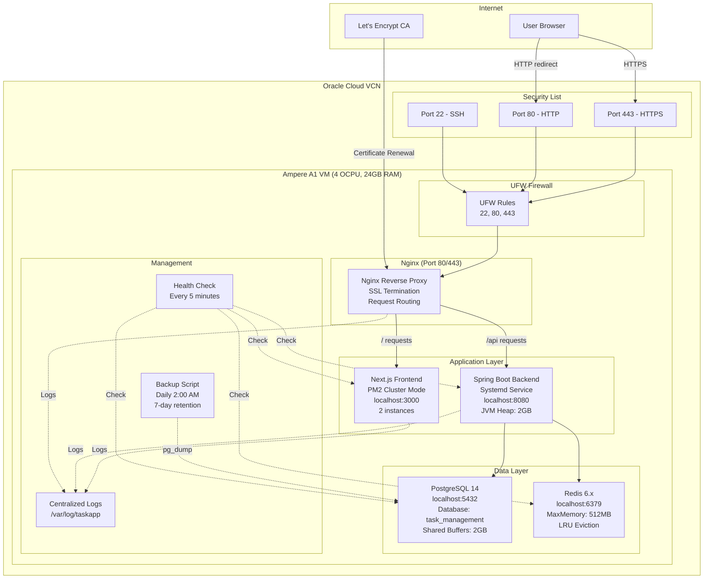

# Design Document: Oracle Cloud Always Free Deployment

## Overview

This design document specifies the deployment architecture for a full-stack task management application on Oracle Cloud Infrastructure (OCI) Always Free Tier. The deployment uses a single Ampere A1 VM (4 OCPU, 24GB RAM) running Ubuntu 22.04 LTS to host all application components: Next.js 14 frontend, Spring Boot 3.3.5 backend, PostgreSQL 14 database, and Redis 6.x cache.

The deployment is designed to be:
- **Cost-free forever**: Uses only Always Free Tier resources
- **Production-ready**: Includes SSL, monitoring, backups, and security hardening
- **Automated**: Single-script deployment and updates
- **Resilient**: Automatic service restarts and health monitoring

### Key Design Decisions

1. **Single VM Architecture**: All services run on one VM to stay within Always Free limits while the 24GB RAM provides sufficient resources for all components
2. **Systemd for Backend**: Spring Boot runs as a systemd service for reliable lifecycle management and automatic restarts
3. **PM2 for Frontend**: Next.js runs under PM2 in cluster mode (2 instances) for better resource utilization and zero-downtime restarts
4. **Nginx Reverse Proxy**: Single entry point for both frontend and backend, handles SSL termination and request routing
5. **Local-only Database/Cache**: PostgreSQL and Redis listen only on localhost for security
6. **Let's Encrypt SSL**: Free automated SSL certificates with auto-renewal
7. **UFW Firewall**: Simple, effective firewall allowing only SSH, HTTP, and HTTPS

## Architecture

### High-Level Architecture Diagram



### Network Flow

1. **User Request Flow**:
   - User accesses `https://yourdomain.com`
   - Request hits OCI Security List (port 443 allowed)
   - UFW firewall allows port 443
   - Nginx receives request, terminates SSL
   - Nginx routes to Frontend (/) or Backend (/api)
   - Response flows back through Nginx with SSL encryption

2. **Internal Communication**:
   - All services communicate via localhost
   - Backend connects to PostgreSQL on localhost:5432
   - Backend connects to Redis on localhost:6379
   - No external access to database or cache

3. **Management Operations**:
   - SSH access on port 22 (key-based only)
   - Cron jobs trigger backups and health checks
   - Logs written to /var/log/taskapp

## Components and Interfaces

### 1. Oracle Cloud Infrastructure

**Component**: OCI Always Free Tier VM

**Configuration**:
- **Shape**: VM.Standard.A1.Flex (Ampere ARM processor)
- **OCPU**: 4 cores (maximum for Always Free)
- **Memory**: 24GB RAM (maximum for Always Free)
- **Boot Volume**: 200GB block storage
- **OS**: Ubuntu 22.04 LTS (ARM64)
- **Network**: Public subnet in VCN with reserved public IP

**Security List Rules**:
```
Ingress Rules:
- Source: 0.0.0.0/0, Protocol: TCP, Port: 22 (SSH)
- Source: 0.0.0.0/0, Protocol: TCP, Port: 80 (HTTP)
- Source: 0.0.0.0/0, Protocol: TCP, Port: 443 (HTTPS)

Egress Rules:
- Destination: 0.0.0.0/0, Protocol: All, All Ports
```

**Interface**: OCI Console Web UI and CLI

### 2. Nginx Reverse Proxy

**Component**: Nginx 1.18+ (Ubuntu package)

**Configuration File**: `/etc/nginx/sites-available/taskapp`

**Key Configuration**:
```nginx
# HTTP server - redirect to HTTPS
server {
    listen 80;
    server_name yourdomain.com;
    return 301 https://$server_name$request_uri;
}

# HTTPS server
server {
    listen 443 ssl http2;
    server_name yourdomain.com;
    
    # SSL configuration (managed by Certbot)
    ssl_certificate /etc/letsencrypt/live/yourdomain.com/fullchain.pem;
    ssl_certificate_key /etc/letsencrypt/live/yourdomain.com/privkey.pem;
    ssl_protocols TLSv1.2 TLSv1.3;
    ssl_ciphers HIGH:!aNULL:!MD5;
    ssl_prefer_server_ciphers on;
    ssl_session_cache shared:SSL:10m;
    ssl_session_timeout 10m;
    
    # Security headers
    add_header Strict-Transport-Security "max-age=31536000; includeSubDomains" always;
    add_header X-Frame-Options "SAMEORIGIN" always;
    add_header X-Content-Type-Options "nosniff" always;
    
    # Hide Nginx version
    server_tokens off;
    
    # File upload size
    client_max_body_size 25M;
    
    # Gzip compression
    gzip on;
    gzip_types text/plain text/css application/json application/javascript text/xml application/xml application/xml+rss text/javascript;
    
    # Frontend proxy (Next.js)
    location / {
        proxy_pass http://localhost:3000;
        proxy_http_version 1.1;
        proxy_set_header Upgrade $http_upgrade;
        proxy_set_header Connection 'upgrade';
        proxy_set_header Host $host;
        proxy_set_header X-Real-IP $remote_addr;
        proxy_set_header X-Forwarded-For $proxy_add_x_forwarded_for;
        proxy_set_header X-Forwarded-Proto $scheme;
        proxy_cache_bypass $http_upgrade;
        proxy_read_timeout 60s;
        proxy_connect_timeout 60s;
        proxy_send_timeout 60s;
    }
    
    # Backend proxy (Spring Boot)
    location /api {
        rewrite ^/api/(.*) /$1 break;
        proxy_pass http://localhost:8080;
        proxy_http_version 1.1;
        proxy_set_header Host $host;
        proxy_set_header X-Real-IP $remote_addr;
        proxy_set_header X-Forwarded-For $proxy_add_x_forwarded_for;
        proxy_set_header X-Forwarded-Proto $scheme;
        proxy_read_timeout 60s;
        proxy_connect_timeout 60s;
        proxy_send_timeout 60s;
    }
}
```

**Interface**:
- Listens on ports 80 (HTTP) and 443 (HTTPS)
- Proxies to localhost:3000 (Frontend) and localhost:8080 (Backend)

### 3. Spring Boot Backend Service

**Component**: Spring Boot 3.3.5 application with embedded Tomcat

**Systemd Service File**: `/etc/systemd/system/taskapp-backend.service`

```ini
[Unit]
Description=Task Management Backend Service
After=network.target postgresql.service redis.service
Wants=postgresql.service redis.service

[Service]
Type=simple
User=taskapp
Group=taskapp
WorkingDirectory=/opt/taskapp
EnvironmentFile=/opt/taskapp/.env
ExecStart=/usr/bin/java -Xmx2g -Xms512m -jar /opt/taskapp/backend.jar
Restart=always
RestartSec=10
StandardOutput=append:/var/log/taskapp/backend.log
StandardError=append:/var/log/taskapp/backend.log

# Security
NoNewPrivileges=true
PrivateTmp=true

[Install]
WantedBy=multi-user.target
```

**Environment Variables** (in `/opt/taskapp/.env`):
```bash
# Database
DB_URL=jdbc:postgresql://localhost:5432/task_management
DB_USERNAME=taskapp_user
DB_PASSWORD=<strong-password>

# Redis
REDIS_HOST=localhost
REDIS_PORT=6379

# Mail
MAIL_USERNAME=<email>
MAIL_PASSWORD=<app-password>

# OAuth2
GOOGLE_CLIENT_ID=<client-id>
GOOGLE_CLIENT_SECRET=<client-secret>

# ImageKit
IMAGEKIT_PUBLIC_KEY=<public-key>
IMAGEKIT_PRIVATE_KEY=<private-key>
IMAGEKIT_URL_ENDPOINT=<url-endpoint>

# Google Calendar
GOOGLE_CREDENTIALS_PATH=/opt/taskapp/config/google-credentials.json

# Application
SERVER_PORT=8080
SPRING_PROFILES_ACTIVE=prod
```

**Interface**:
- Listens on localhost:8080
- Exposes REST API endpoints under /api
- Health check endpoint: /actuator/health

### 4. Next.js Frontend Service

**Component**: Next.js 14 application in production mode

**PM2 Configuration**: `/opt/taskapp/frontend/ecosystem.config.js`

```javascript
module.exports = {
  apps: [{
    name: 'taskapp-frontend',
    cwd: '/opt/taskapp/frontend',
    script: 'npm',
    args: 'start',
    instances: 2,
    exec_mode: 'cluster',
    watch: false,
    max_memory_restart: '1G',
    env: {
      NODE_ENV: 'production',
      PORT: 3000,
      NEXT_PUBLIC_API_URL: 'https://yourdomain.com/api'
    },
    error_file: '/var/log/taskapp/frontend-error.log',
    out_file: '/var/log/taskapp/frontend-out.log',
    log_date_format: 'YYYY-MM-DD HH:mm:ss Z',
    merge_logs: true,
    autorestart: true,
    max_restarts: 10,
    min_uptime: '10s'
  }]
};
```

**Interface**:
- Listens on localhost:3000
- Serves static assets and server-side rendered pages
- Communicates with backend via /api proxy

### 5. PostgreSQL Database

**Component**: PostgreSQL 14 (Ubuntu package)

**Configuration File**: `/etc/postgresql/14/main/postgresql.conf`

**Key Settings**:
```ini
# Connection settings
listen_addresses = 'localhost'
port = 5432
max_connections = 100

# Memory settings
shared_buffers = 2GB
effective_cache_size = 6GB
maintenance_work_mem = 512MB
work_mem = 20MB

# Write-ahead log
wal_buffers = 16MB
checkpoint_completion_target = 0.9

# Query tuning
random_page_cost = 1.1
effective_io_concurrency = 200
```

**Authentication**: `/etc/postgresql/14/main/pg_hba.conf`
```
# Local connections only
local   all             postgres                                peer
local   all             all                                     md5
host    all             all             127.0.0.1/32            md5
host    all             all             ::1/128                 md5
```

**Database Setup**:
```sql
CREATE DATABASE task_management;
CREATE USER taskapp_user WITH ENCRYPTED PASSWORD '<strong-password>';
GRANT ALL PRIVILEGES ON DATABASE task_management TO taskapp_user;
\c task_management
GRANT ALL ON SCHEMA public TO taskapp_user;
```

**Interface**:
- Listens on localhost:5432
- Accessed by Spring Boot backend only
- Liquibase manages schema migrations

### 6. Redis Cache

**Component**: Redis 6.x (Ubuntu package)

**Configuration File**: `/etc/redis/redis.conf`

**Key Settings**:
```ini
# Network
bind 127.0.0.1
port 6379
protected-mode yes

# Memory management
maxmemory 512mb
maxmemory-policy allkeys-lru

# Persistence
appendonly yes
appendfsync everysec
save 900 1
save 300 10
save 60 10000

# Performance
tcp-backlog 511
timeout 0
tcp-keepalive 300
```

**Interface**:
- Listens on localhost:6379
- Used for session storage and caching
- Accessed by Spring Boot backend only

### 7. UFW Firewall

**Component**: Uncomplicated Firewall (Ubuntu package)

**Configuration**:
```bash
# Default policies
ufw default deny incoming
ufw default allow outgoing

# Allow rules
ufw allow 22/tcp    # SSH
ufw allow 80/tcp    # HTTP
ufw allow 443/tcp   # HTTPS

# Enable firewall
ufw enable

# Enable logging
ufw logging on
```

**Interface**:
- Filters all incoming traffic
- Logs denied connections to /var/log/ufw.log

## Data Models

### File System Structure

```
/opt/taskapp/
├── backend.jar                 # Spring Boot executable JAR
├── frontend/                   # Next.js production build
│   ├── .next/                 # Next.js build output
│   ├── node_modules/          # Node dependencies
│   ├── package.json
│   ├── ecosystem.config.js    # PM2 configuration
│   └── ...
├── config/
│   └── google-credentials.json # Google Calendar API credentials
├── backups/                    # Database backups
│   ├── task_management_2024-01-15_02-00-00.sql.gz
│   └── ...
├── scripts/
│   ├── deploy.sh              # Deployment automation script
│   ├── backup-db.sh           # Database backup script
│   └── health-check.sh        # Health monitoring script
├── .env                        # Environment variables (600 permissions)
└── README.md                   # Deployment documentation

/var/log/taskapp/
├── backend.log                 # Spring Boot logs
├── frontend-out.log            # PM2 stdout logs
├── frontend-error.log          # PM2 stderr logs
├── backup.log                  # Backup operation logs
└── health-check.log            # Health check logs

/etc/systemd/system/
└── taskapp-backend.service     # Backend systemd service

/etc/nginx/
├── sites-available/
│   └── taskapp                 # Nginx configuration
└── sites-enabled/
    └── taskapp -> ../sites-available/taskapp

/etc/letsencrypt/
└── live/
    └── yourdomain.com/
        ├── fullchain.pem       # SSL certificate
        └── privkey.pem         # SSL private key
```

### Environment Configuration Model

The `.env` file contains all sensitive configuration:

```bash
# Database Configuration
DB_URL=jdbc:postgresql://localhost:5432/task_management
DB_USERNAME=taskapp_user
DB_PASSWORD=<generated-strong-password>

# Redis Configuration
REDIS_HOST=localhost
REDIS_PORT=6379

# Email Configuration
MAIL_USERNAME=<gmail-address>
MAIL_PASSWORD=<gmail-app-password>

# OAuth2 Configuration
GOOGLE_CLIENT_ID=<google-oauth-client-id>
GOOGLE_CLIENT_SECRET=<google-oauth-client-secret>

# ImageKit Configuration
IMAGEKIT_PUBLIC_KEY=<imagekit-public-key>
IMAGEKIT_PRIVATE_KEY=<imagekit-private-key>
IMAGEKIT_URL_ENDPOINT=<imagekit-url-endpoint>

# Google Calendar Configuration
GOOGLE_CREDENTIALS_PATH=/opt/taskapp/config/google-credentials.json

# Application Configuration
SERVER_PORT=8080
SPRING_PROFILES_ACTIVE=prod
```

**Security**:
- File permissions: 600 (owner read/write only)
- Owner: taskapp:taskapp
- Never committed to version control

## Error Handling

### Service Failure Handling

1. **Spring Boot Backend Failure**:
   - Systemd automatically restarts after 10 seconds
   - Maximum restart attempts: unlimited
   - Logs failure to /var/log/taskapp/backend.log
   - Health check detects failure and logs alert

2. **Next.js Frontend Failure**:
   - PM2 automatically restarts immediately
   - Maximum 10 restarts within 1 minute (then stops)
   - Requires minimum 10s uptime before considering stable
   - Logs failure to PM2 logs

3. **PostgreSQL Failure**:
   - Systemd manages PostgreSQL service
   - Backend service waits for PostgreSQL (After= dependency)
   - Connection pool retries on transient failures
   - Health check detects database unavailability

4. **Redis Failure**:
   - Systemd manages Redis service
   - Backend gracefully handles Redis unavailability
   - Sessions may be lost but application continues
   - Health check detects Redis unavailability

5. **Nginx Failure**:
   - Systemd automatically restarts Nginx
   - Configuration tested before reload (nginx -t)
   - Syntax errors prevent reload, keeping old config active

### Deployment Failure Handling

The deployment script includes rollback capability:

```bash
# Backup current version before deployment
cp /opt/taskapp/backend.jar /opt/taskapp/backend.jar.backup
cp -r /opt/taskapp/frontend /opt/taskapp/frontend.backup

# Deploy new version
# ... deployment steps ...

# If deployment fails, rollback
if [ $? -ne 0 ]; then
    echo "Deployment failed, rolling back..."
    mv /opt/taskapp/backend.jar.backup /opt/taskapp/backend.jar
    rm -rf /opt/taskapp/frontend
    mv /opt/taskapp/frontend.backup /opt/taskapp/frontend
    systemctl restart taskapp-backend
    pm2 restart taskapp-frontend
    exit 1
fi
```

### SSL Certificate Renewal Failure

- Certbot runs renewal check twice daily via systemd timer
- If renewal fails, Certbot logs to /var/log/letsencrypt/
- Certificates valid for 90 days, renewal attempted at 60 days
- Manual renewal command: `sudo certbot renew --nginx`

### Backup Failure Handling

```bash
# In backup-db.sh
if ! pg_dump -U taskapp_user task_management | gzip > "$BACKUP_FILE"; then
    echo "$(date): Backup failed" >> /var/log/taskapp/backup.log
    # Send alert (optional: email notification)
    exit 1
fi

# Verify backup file exists and is not empty
if [ ! -s "$BACKUP_FILE" ]; then
    echo "$(date): Backup file is empty or missing" >> /var/log/taskapp/backup.log
    exit 1
fi
```

### Network and Firewall Issues

- UFW logs denied connections to /var/log/ufw.log
- If locked out via SSH, use OCI Console's Cloud Shell or VNC
- Security List rules in OCI take precedence over UFW
- Always test firewall rules before disconnecting SSH

## Testing Strategy

Since this is an Infrastructure as Code (IaC) deployment specification, property-based testing is not applicable. The testing strategy focuses on:

### 1. Pre-Deployment Validation

**Configuration Validation**:
- Verify all required environment variables are set
- Validate domain DNS points to VM public IP
- Check OCI Security List rules are configured
- Verify SSH key access to VM

**Syntax Validation**:
```bash
# Nginx configuration
sudo nginx -t

# Systemd service file
systemd-analyze verify taskapp-backend.service

# Shell scripts
bash -n /opt/taskapp/scripts/deploy.sh
bash -n /opt/taskapp/scripts/backup-db.sh
bash -n /opt/taskapp/scripts/health-check.sh
```

### 2. Post-Deployment Integration Tests

**Service Availability Tests**:
```bash
# Backend health check
curl -f http://localhost:8080/actuator/health || echo "Backend health check failed"

# Frontend availability
curl -f http://localhost:3000 || echo "Frontend availability check failed"

# Database connectivity
psql -U taskapp_user -d task_management -c "SELECT 1;" || echo "Database connection failed"

# Redis connectivity
redis-cli ping || echo "Redis connection failed"

# HTTPS endpoint
curl -f https://yourdomain.com || echo "HTTPS endpoint failed"
```

**Service Integration Tests**:
```bash
# Test frontend -> backend -> database flow
curl -X POST https://yourdomain.com/api/auth/login \
  -H "Content-Type: application/json" \
  -d '{"email":"test@example.com","password":"test123"}' \
  || echo "Login flow failed"

# Test file upload (ImageKit integration)
curl -X POST https://yourdomain.com/api/upload \
  -H "Authorization: Bearer <token>" \
  -F "file=@test-image.jpg" \
  || echo "File upload failed"
```

### 3. Security Tests

**Firewall Tests**:
```bash
# Verify only allowed ports are open
nmap -p 1-65535 <vm-public-ip>
# Expected: 22, 80, 443 open; all others closed/filtered

# Verify database is not accessible externally
nmap -p 5432 <vm-public-ip>
# Expected: filtered or closed

# Verify Redis is not accessible externally
nmap -p 6379 <vm-public-ip>
# Expected: filtered or closed
```

**SSL/TLS Tests**:
```bash
# Test SSL certificate validity
echo | openssl s_client -connect yourdomain.com:443 -servername yourdomain.com 2>/dev/null | openssl x509 -noout -dates

# Test SSL configuration strength
sslscan yourdomain.com
# Or use: https://www.ssllabs.com/ssltest/
```

**Authentication Tests**:
```bash
# Verify SSH key-only authentication
ssh -o PasswordAuthentication=yes ubuntu@<vm-ip>
# Expected: Permission denied (publickey)

# Verify root login disabled
ssh root@<vm-ip>
# Expected: Permission denied
```

### 4. Performance and Load Tests

**Resource Usage Monitoring**:
```bash
# Check memory usage
free -h
# Verify: Used < 20GB (leaving headroom)

# Check CPU usage
top -bn1 | head -20
# Verify: Load average < 4.0

# Check disk usage
df -h
# Verify: / partition < 80% used
```

**Basic Load Test**:
```bash
# Install Apache Bench
sudo apt install apache2-utils

# Test frontend performance
ab -n 1000 -c 10 https://yourdomain.com/

# Test backend API performance
ab -n 1000 -c 10 https://yourdomain.com/api/health
```

### 5. Backup and Recovery Tests

**Backup Verification**:
```bash
# Run backup manually
sudo -u taskapp /opt/taskapp/scripts/backup-db.sh

# Verify backup file exists
ls -lh /opt/taskapp/backups/

# Test backup integrity
gunzip -c /opt/taskapp/backups/task_management_*.sql.gz | head -20
```

**Recovery Test**:
```bash
# Create test database
sudo -u postgres createdb task_management_test

# Restore from backup
gunzip -c /opt/taskapp/backups/task_management_*.sql.gz | \
  sudo -u postgres psql task_management_test

# Verify restoration
sudo -u postgres psql task_management_test -c "\dt"

# Cleanup
sudo -u postgres dropdb task_management_test
```

### 6. Monitoring and Alerting Tests

**Health Check Validation**:
```bash
# Run health check manually
/opt/taskapp/scripts/health-check.sh

# Verify health check logs
tail -20 /var/log/taskapp/health-check.log

# Simulate service failure
sudo systemctl stop taskapp-backend
/opt/taskapp/scripts/health-check.sh
# Expected: Failure logged

# Restore service
sudo systemctl start taskapp-backend
```

**Log Rotation Tests**:
```bash
# Force log rotation
sudo logrotate -f /etc/logrotate.d/taskapp

# Verify rotated logs
ls -lh /var/log/taskapp/
```

### 7. Deployment and Rollback Tests

**Deployment Test**:
```bash
# Test deployment script (dry-run mode if available)
sudo -u taskapp /opt/taskapp/scripts/deploy.sh

# Verify services restarted
systemctl status taskapp-backend
pm2 status

# Check application version/build
curl https://yourdomain.com/api/actuator/info
```

**Rollback Test**:
```bash
# Simulate deployment failure
# (manually trigger rollback section of deploy script)

# Verify rollback successful
systemctl status taskapp-backend
pm2 status
```

### 8. Automated Testing Schedule

**Daily Tests** (via cron):
- Health checks every 5 minutes
- Backup integrity check after daily backup
- Disk space monitoring

**Weekly Tests** (manual or automated):
- SSL certificate expiration check
- Security updates check
- Log file review

**Monthly Tests** (manual):
- Full backup and restore test
- Security audit (nmap, fail2ban logs)
- Performance baseline comparison

### Test Documentation

All test results should be documented with:
- Test date and time
- Test type and scope
- Pass/fail status
- Any anomalies or issues discovered
- Remediation actions taken

This testing strategy ensures the deployment is reliable, secure, and maintainable without requiring property-based testing, which is not applicable to infrastructure deployment scenarios.


## Deployment Procedures

### Initial Deployment

This section provides step-by-step instructions for the complete initial deployment.

#### Phase 1: Oracle Cloud Account Setup

**Step 1.1: Create Oracle Cloud Account**

```bash
# Navigate to Oracle Cloud sign-up page
# URL: https://www.oracle.com/cloud/free/

# Complete registration:
# - Email address
# - Password
# - Country/Region
# - Phone verification
# - Credit card (for identity verification only - will NOT be charged)
```

**Step 1.2: Verify Always Free Eligibility**

```bash
# After login, navigate to: Account > Tenancy Details
# Verify "Account Type: Free Tier" is displayed
# Confirm Always Free resources available:
# - 2 AMD VMs or 4 Arm-based Ampere A1 cores
# - 24 GB RAM
# - 200 GB block storage
```

#### Phase 2: VM Provisioning

**Step 2.1: Create VCN (Virtual Cloud Network)**

```bash
# In OCI Console:
# 1. Navigate to: Networking > Virtual Cloud Networks
# 2. Click "Start VCN Wizard"
# 3. Select "Create VCN with Internet Connectivity"
# 4. Configuration:
#    - VCN Name: taskapp-vcn
#    - Compartment: (root)
#    - VCN CIDR Block: 10.0.0.0/16
#    - Public Subnet CIDR: 10.0.0.0/24
#    - Private Subnet CIDR: 10.0.1.0/24
# 5. Click "Next" then "Create"
```

**Step 2.2: Configure Security List**

```bash
# In OCI Console:
# 1. Navigate to: Networking > Virtual Cloud Networks > taskapp-vcn
# 2. Click "Security Lists" > "Default Security List"
# 3. Add Ingress Rules:

# SSH Rule
Source CIDR: 0.0.0.0/0
IP Protocol: TCP
Source Port Range: All
Destination Port Range: 22
Description: SSH access

# HTTP Rule
Source CIDR: 0.0.0.0/0
IP Protocol: TCP
Source Port Range: All
Destination Port Range: 80
Description: HTTP access

# HTTPS Rule
Source CIDR: 0.0.0.0/0
IP Protocol: TCP
Source Port Range: All
Destination Port Range: 443
Description: HTTPS access

# 4. Verify Egress Rules allow all traffic (default)
```

**Step 2.3: Create Compute Instance**

```bash
# In OCI Console:
# 1. Navigate to: Compute > Instances
# 2. Click "Create Instance"
# 3. Configuration:

# Name and Compartment
Name: taskapp-vm
Compartment: (root)

# Placement
Availability Domain: (select any)

# Image and Shape
Image: Canonical Ubuntu 22.04 (ARM64)
Shape: VM.Standard.A1.Flex
  - OCPU count: 4 (maximum for Always Free)
  - Memory: 24 GB (maximum for Always Free)

# Networking
VCN: taskapp-vcn
Subnet: Public Subnet (regional)
Public IP: Assign a reserved public IPv4 address

# Add SSH Keys
Upload your public SSH key file (id_rsa.pub)
# Or generate new key pair and download private key

# Boot Volume
Size: 200 GB (maximum for Always Free)

# 4. Click "Create"
# 5. Wait for instance state: RUNNING (takes 2-3 minutes)
# 6. Note the Public IP address
```

**Step 2.4: Configure DNS**

```bash
# In your domain registrar (e.g., Namecheap, GoDaddy, Cloudflare):
# 1. Add A record:
#    Host: @ (or yourdomain.com)
#    Value: <VM-PUBLIC-IP>
#    TTL: 300 (5 minutes)
#
# 2. Add A record for www (optional):
#    Host: www
#    Value: <VM-PUBLIC-IP>
#    TTL: 300

# Verify DNS propagation (may take 5-60 minutes):
dig yourdomain.com +short
# Should return: <VM-PUBLIC-IP>
```

#### Phase 3: Initial Server Setup

**Step 3.1: Connect to VM**

```bash
# Set correct permissions on private key
chmod 600 ~/.ssh/id_rsa

# Connect via SSH
ssh -i ~/.ssh/id_rsa ubuntu@<VM-PUBLIC-IP>

# If using OCI-generated key:
ssh -i ~/Downloads/ssh-key-*.key ubuntu@<VM-PUBLIC-IP>
```

**Step 3.2: Update System**

```bash
# Update package lists
sudo apt update

# Upgrade all packages
sudo apt upgrade -y

# Install basic utilities
sudo apt install -y curl wget git vim htop unzip
```

**Step 3.3: Configure Firewall**

```bash
# Install UFW
sudo apt install -y ufw

# Set default policies
sudo ufw default deny incoming
sudo ufw default allow outgoing

# Allow SSH (IMPORTANT: do this before enabling UFW)
sudo ufw allow 22/tcp

# Allow HTTP and HTTPS
sudo ufw allow 80/tcp
sudo ufw allow 443/tcp

# Enable firewall
sudo ufw enable

# Verify status
sudo ufw status verbose
```

#### Phase 4: Install Dependencies

**Step 4.1: Install OpenJDK 17**

```bash
# Install OpenJDK 17
sudo apt install -y openjdk-17-jdk

# Verify installation
java -version
# Expected output: openjdk version "17.0.x"

# Set JAVA_HOME
echo 'export JAVA_HOME=/usr/lib/jvm/java-17-openjdk-arm64' | sudo tee -a /etc/environment
source /etc/environment
```

**Step 4.2: Install Node.js 20 LTS**

```bash
# Install Node.js 20 LTS using NodeSource repository
curl -fsSL https://deb.nodesource.com/setup_20.x | sudo -E bash -
sudo apt install -y nodejs

# Verify installation
node --version  # Should show v20.x.x
npm --version   # Should show 10.x.x
```

**Step 4.3: Install PostgreSQL 14**

```bash
# Install PostgreSQL
sudo apt install -y postgresql postgresql-contrib

# Verify installation
sudo systemctl status postgresql

# Verify version
psql --version  # Should show 14.x
```

**Step 4.4: Install Redis**

```bash
# Install Redis
sudo apt install -y redis-server

# Verify installation
sudo systemctl status redis-server

# Verify version
redis-server --version  # Should show 6.x or 7.x
```

**Step 4.5: Install Nginx**

```bash
# Install Nginx
sudo apt install -y nginx

# Verify installation
sudo systemctl status nginx

# Verify version
nginx -v  # Should show 1.18.x or higher
```

**Step 4.6: Install PM2**

```bash
# Install PM2 globally
sudo npm install -g pm2

# Verify installation
pm2 --version
```

**Step 4.7: Install Maven**

```bash
# Install Maven
sudo apt install -y maven

# Verify installation
mvn --version  # Should show 3.6.x or higher
```

**Step 4.8: Install Certbot**

```bash
# Install Certbot with Nginx plugin
sudo apt install -y certbot python3-certbot-nginx

# Verify installation
certbot --version
```

#### Phase 5: Configure PostgreSQL

**Step 5.1: Create Database and User**

```bash
# Switch to postgres user
sudo -u postgres psql

# In PostgreSQL prompt:
CREATE DATABASE task_management;
CREATE USER taskapp_user WITH ENCRYPTED PASSWORD 'CHANGE_THIS_PASSWORD';
GRANT ALL PRIVILEGES ON DATABASE task_management TO taskapp_user;
\c task_management
GRANT ALL ON SCHEMA public TO taskapp_user;
\q
```

**Step 5.2: Configure PostgreSQL**

```bash
# Edit PostgreSQL configuration
sudo vim /etc/postgresql/14/main/postgresql.conf

# Update these settings:
listen_addresses = 'localhost'
max_connections = 100
shared_buffers = 2GB
effective_cache_size = 6GB
maintenance_work_mem = 512MB
work_mem = 20MB

# Save and exit

# Restart PostgreSQL
sudo systemctl restart postgresql

# Verify connection
psql -U taskapp_user -d task_management -h localhost -c "SELECT 1;"
# Enter password when prompted
```

#### Phase 6: Configure Redis

**Step 6.1: Configure Redis**

```bash
# Edit Redis configuration
sudo vim /etc/redis/redis.conf

# Update these settings:
bind 127.0.0.1
maxmemory 512mb
maxmemory-policy allkeys-lru
appendonly yes
appendfsync everysec

# Save and exit

# Restart Redis
sudo systemctl restart redis-server

# Verify connection
redis-cli ping
# Expected output: PONG
```

#### Phase 7: Create Application User and Directories

**Step 7.1: Create System User**

```bash
# Create taskapp user (no login shell)
sudo useradd -r -s /bin/bash -d /opt/taskapp -m taskapp

# Create directory structure
sudo mkdir -p /opt/taskapp/{backups,scripts,config}
sudo mkdir -p /var/log/taskapp

# Set ownership
sudo chown -R taskapp:taskapp /opt/taskapp
sudo chown -R taskapp:taskapp /var/log/taskapp

# Set permissions
sudo chmod 750 /opt/taskapp
sudo chmod 750 /var/log/taskapp
```

#### Phase 8: Deploy Backend Application

**Step 8.1: Build Backend**

```bash
# Clone repository (or upload code)
cd /tmp
git clone <your-backend-repo-url>
cd <backend-repo-directory>

# Build with Maven
mvn clean package -DskipTests

# Copy JAR to deployment directory
sudo cp target/*.jar /opt/taskapp/backend.jar
sudo chown taskapp:taskapp /opt/taskapp/backend.jar
```

**Step 8.2: Create Environment File**

```bash
# Create .env file
sudo vim /opt/taskapp/.env

# Add configuration (replace with actual values):
DB_URL=jdbc:postgresql://localhost:5432/task_management
DB_USERNAME=taskapp_user
DB_PASSWORD=CHANGE_THIS_PASSWORD
REDIS_HOST=localhost
REDIS_PORT=6379
MAIL_USERNAME=your-email@gmail.com
MAIL_PASSWORD=your-app-password
GOOGLE_CLIENT_ID=your-google-client-id
GOOGLE_CLIENT_SECRET=your-google-client-secret
IMAGEKIT_PUBLIC_KEY=your-imagekit-public-key
IMAGEKIT_PRIVATE_KEY=your-imagekit-private-key
IMAGEKIT_URL_ENDPOINT=your-imagekit-url
GOOGLE_CREDENTIALS_PATH=/opt/taskapp/config/google-credentials.json
SERVER_PORT=8080
SPRING_PROFILES_ACTIVE=prod

# Save and exit

# Set secure permissions
sudo chmod 600 /opt/taskapp/.env
sudo chown taskapp:taskapp /opt/taskapp/.env
```

**Step 8.3: Copy Google Credentials**

```bash
# Copy google-credentials.json to server
scp -i ~/.ssh/id_rsa google-credentials.json ubuntu@<VM-PUBLIC-IP>:/tmp/

# Move to config directory
sudo mv /tmp/google-credentials.json /opt/taskapp/config/
sudo chown taskapp:taskapp /opt/taskapp/config/google-credentials.json
sudo chmod 600 /opt/taskapp/config/google-credentials.json
```

**Step 8.4: Create Systemd Service**

```bash
# Create service file
sudo vim /etc/systemd/system/taskapp-backend.service

# Add content:
[Unit]
Description=Task Management Backend Service
After=network.target postgresql.service redis.service
Wants=postgresql.service redis.service

[Service]
Type=simple
User=taskapp
Group=taskapp
WorkingDirectory=/opt/taskapp
EnvironmentFile=/opt/taskapp/.env
ExecStart=/usr/bin/java -Xmx2g -Xms512m -jar /opt/taskapp/backend.jar
Restart=always
RestartSec=10
StandardOutput=append:/var/log/taskapp/backend.log
StandardError=append:/var/log/taskapp/backend.log
NoNewPrivileges=true
PrivateTmp=true

[Install]
WantedBy=multi-user.target

# Save and exit

# Reload systemd
sudo systemctl daemon-reload

# Enable service
sudo systemctl enable taskapp-backend

# Start service
sudo systemctl start taskapp-backend

# Check status
sudo systemctl status taskapp-backend

# View logs
sudo tail -f /var/log/taskapp/backend.log
```

#### Phase 9: Deploy Frontend Application

**Step 9.1: Build Frontend**

```bash
# Clone repository (or upload code)
cd /tmp
git clone <your-frontend-repo-url>
cd <frontend-repo-directory>

# Install dependencies
npm install

# Create production build
npm run build

# Copy to deployment directory
sudo cp -r .next node_modules package.json package-lock.json public /opt/taskapp/frontend/
sudo chown -R taskapp:taskapp /opt/taskapp/frontend
```

**Step 9.2: Create PM2 Ecosystem File**

```bash
# Create PM2 configuration
sudo vim /opt/taskapp/frontend/ecosystem.config.js

# Add content:
module.exports = {
  apps: [{
    name: 'taskapp-frontend',
    cwd: '/opt/taskapp/frontend',
    script: 'npm',
    args: 'start',
    instances: 2,
    exec_mode: 'cluster',
    watch: false,
    max_memory_restart: '1G',
    env: {
      NODE_ENV: 'production',
      PORT: 3000,
      NEXT_PUBLIC_API_URL: 'https://yourdomain.com/api'
    },
    error_file: '/var/log/taskapp/frontend-error.log',
    out_file: '/var/log/taskapp/frontend-out.log',
    log_date_format: 'YYYY-MM-DD HH:mm:ss Z',
    merge_logs: true,
    autorestart: true,
    max_restarts: 10,
    min_uptime: '10s'
  }]
};

# Save and exit
sudo chown taskapp:taskapp /opt/taskapp/frontend/ecosystem.config.js
```

**Step 9.3: Start Frontend with PM2**

```bash
# Switch to taskapp user
sudo -u taskapp -i

# Start application with PM2
cd /opt/taskapp/frontend
pm2 start ecosystem.config.js

# Save PM2 process list
pm2 save

# Exit taskapp user
exit

# Configure PM2 to start on boot
sudo env PATH=$PATH:/usr/bin pm2 startup systemd -u taskapp --hp /opt/taskapp

# Verify PM2 status
sudo -u taskapp pm2 status
```

#### Phase 10: Configure Nginx

**Step 10.1: Create Nginx Configuration**

```bash
# Create site configuration
sudo vim /etc/nginx/sites-available/taskapp

# Add content (replace yourdomain.com with your actual domain):
server {
    listen 80;
    server_name yourdomain.com www.yourdomain.com;
    
    location / {
        proxy_pass http://localhost:3000;
        proxy_http_version 1.1;
        proxy_set_header Upgrade $http_upgrade;
        proxy_set_header Connection 'upgrade';
        proxy_set_header Host $host;
        proxy_set_header X-Real-IP $remote_addr;
        proxy_set_header X-Forwarded-For $proxy_add_x_forwarded_for;
        proxy_set_header X-Forwarded-Proto $scheme;
        proxy_cache_bypass $http_upgrade;
    }
    
    location /api {
        rewrite ^/api/(.*) /$1 break;
        proxy_pass http://localhost:8080;
        proxy_http_version 1.1;
        proxy_set_header Host $host;
        proxy_set_header X-Real-IP $remote_addr;
        proxy_set_header X-Forwarded-For $proxy_add_x_forwarded_for;
        proxy_set_header X-Forwarded-Proto $scheme;
    }
    
    client_max_body_size 25M;
}

# Save and exit

# Enable site
sudo ln -s /etc/nginx/sites-available/taskapp /etc/nginx/sites-enabled/

# Remove default site
sudo rm /etc/nginx/sites-enabled/default

# Test configuration
sudo nginx -t

# Reload Nginx
sudo systemctl reload nginx
```

**Step 10.2: Obtain SSL Certificate**

```bash
# Run Certbot
sudo certbot --nginx -d yourdomain.com -d www.yourdomain.com

# Follow prompts:
# - Enter email address
# - Agree to terms of service
# - Choose whether to redirect HTTP to HTTPS (select Yes/2)

# Verify certificate
sudo certbot certificates

# Test auto-renewal
sudo certbot renew --dry-run
```

**Step 10.3: Enhance Nginx Security**

```bash
# Edit Nginx configuration
sudo vim /etc/nginx/sites-available/taskapp

# Add security headers in the HTTPS server block:
add_header Strict-Transport-Security "max-age=31536000; includeSubDomains" always;
add_header X-Frame-Options "SAMEORIGIN" always;
add_header X-Content-Type-Options "nosniff" always;
add_header X-XSS-Protection "1; mode=block" always;

# Add gzip compression:
gzip on;
gzip_types text/plain text/css application/json application/javascript text/xml application/xml application/xml+rss text/javascript;
gzip_min_length 1000;

# Hide Nginx version:
server_tokens off;

# Save and exit

# Test and reload
sudo nginx -t
sudo systemctl reload nginx
```

#### Phase 11: Create Management Scripts

**Step 11.1: Create Backup Script**

```bash
# Create backup script
sudo vim /opt/taskapp/scripts/backup-db.sh

# Add content:
#!/bin/bash
BACKUP_DIR="/opt/taskapp/backups"
TIMESTAMP=$(date +"%Y-%m-%d_%H-%M-%S")
BACKUP_FILE="$BACKUP_DIR/task_management_$TIMESTAMP.sql.gz"
LOG_FILE="/var/log/taskapp/backup.log"

echo "$(date): Starting backup..." >> "$LOG_FILE"

# Create backup
if PGPASSWORD="$DB_PASSWORD" pg_dump -U taskapp_user -h localhost task_management | gzip > "$BACKUP_FILE"; then
    echo "$(date): Backup successful: $BACKUP_FILE" >> "$LOG_FILE"
    
    # Delete backups older than 7 days
    find "$BACKUP_DIR" -name "task_management_*.sql.gz" -mtime +7 -delete
    echo "$(date): Old backups cleaned" >> "$LOG_FILE"
else
    echo "$(date): Backup failed!" >> "$LOG_FILE"
    exit 1
fi

# Save and exit

# Make executable
sudo chmod +x /opt/taskapp/scripts/backup-db.sh
sudo chown taskapp:taskapp /opt/taskapp/scripts/backup-db.sh
```

**Step 11.2: Create Health Check Script**

```bash
# Create health check script
sudo vim /opt/taskapp/scripts/health-check.sh

# Add content:
#!/bin/bash
LOG_FILE="/var/log/taskapp/health-check.log"

echo "$(date): Running health checks..." >> "$LOG_FILE"

# Check backend
if curl -f -s http://localhost:8080/actuator/health > /dev/null; then
    echo "$(date): Backend: OK" >> "$LOG_FILE"
else
    echo "$(date): Backend: FAILED" >> "$LOG_FILE"
fi

# Check frontend
if curl -f -s http://localhost:3000 > /dev/null; then
    echo "$(date): Frontend: OK" >> "$LOG_FILE"
else
    echo "$(date): Frontend: FAILED" >> "$LOG_FILE"
fi

# Check PostgreSQL
if PGPASSWORD="$DB_PASSWORD" psql -U taskapp_user -h localhost -d task_management -c "SELECT 1;" > /dev/null 2>&1; then
    echo "$(date): PostgreSQL: OK" >> "$LOG_FILE"
else
    echo "$(date): PostgreSQL: FAILED" >> "$LOG_FILE"
fi

# Check Redis
if redis-cli ping > /dev/null 2>&1; then
    echo "$(date): Redis: OK" >> "$LOG_FILE"
else
    echo "$(date): Redis: FAILED" >> "$LOG_FILE"
fi

# Save and exit

# Make executable
sudo chmod +x /opt/taskapp/scripts/health-check.sh
sudo chown taskapp:taskapp /opt/taskapp/scripts/health-check.sh
```

**Step 11.3: Create Deployment Script**

```bash
# Create deployment script
sudo vim /opt/taskapp/scripts/deploy.sh

# Add content:
#!/bin/bash
set -e

REPO_URL="<your-repo-url>"
WORK_DIR="/tmp/taskapp-deploy"
LOG_FILE="/var/log/taskapp/deploy.log"

echo "$(date): Starting deployment..." >> "$LOG_FILE"

# Backup current version
echo "$(date): Backing up current version..." >> "$LOG_FILE"
cp /opt/taskapp/backend.jar /opt/taskapp/backend.jar.backup
cp -r /opt/taskapp/frontend /opt/taskapp/frontend.backup

# Clone repository
rm -rf "$WORK_DIR"
git clone "$REPO_URL" "$WORK_DIR"

# Build backend
echo "$(date): Building backend..." >> "$LOG_FILE"
cd "$WORK_DIR/backend"
mvn clean package -DskipTests

# Build frontend
echo "$(date): Building frontend..." >> "$LOG_FILE"
cd "$WORK_DIR/frontend"
npm install
npm run build

# Stop services
echo "$(date): Stopping services..." >> "$LOG_FILE"
systemctl stop taskapp-backend
sudo -u taskapp pm2 stop taskapp-frontend

# Deploy backend
echo "$(date): Deploying backend..." >> "$LOG_FILE"
cp "$WORK_DIR/backend/target/*.jar" /opt/taskapp/backend.jar
chown taskapp:taskapp /opt/taskapp/backend.jar

# Deploy frontend
echo "$(date): Deploying frontend..." >> "$LOG_FILE"
rm -rf /opt/taskapp/frontend
mkdir -p /opt/taskapp/frontend
cp -r "$WORK_DIR/frontend/.next" /opt/taskapp/frontend/
cp -r "$WORK_DIR/frontend/node_modules" /opt/taskapp/frontend/
cp "$WORK_DIR/frontend/package.json" /opt/taskapp/frontend/
cp "$WORK_DIR/frontend/ecosystem.config.js" /opt/taskapp/frontend/
chown -R taskapp:taskapp /opt/taskapp/frontend

# Start services
echo "$(date): Starting services..." >> "$LOG_FILE"
systemctl start taskapp-backend
sudo -u taskapp pm2 start /opt/taskapp/frontend/ecosystem.config.js

# Wait for services to start
sleep 10

# Health check
if curl -f http://localhost:8080/actuator/health && curl -f http://localhost:3000; then
    echo "$(date): Deployment successful!" >> "$LOG_FILE"
    rm -rf /opt/taskapp/backend.jar.backup
    rm -rf /opt/taskapp/frontend.backup
else
    echo "$(date): Deployment failed, rolling back..." >> "$LOG_FILE"
    systemctl stop taskapp-backend
    sudo -u taskapp pm2 stop taskapp-frontend
    mv /opt/taskapp/backend.jar.backup /opt/taskapp/backend.jar
    rm -rf /opt/taskapp/frontend
    mv /opt/taskapp/frontend.backup /opt/taskapp/frontend
    systemctl start taskapp-backend
    sudo -u taskapp pm2 start /opt/taskapp/frontend/ecosystem.config.js
    exit 1
fi

# Cleanup
rm -rf "$WORK_DIR"

# Save and exit

# Make executable
sudo chmod +x /opt/taskapp/scripts/deploy.sh
```

**Step 11.4: Schedule Cron Jobs**

```bash
# Edit crontab for taskapp user
sudo crontab -u taskapp -e

# Add cron jobs:
# Daily backup at 2:00 AM
0 2 * * * /opt/taskapp/scripts/backup-db.sh

# Health check every 5 minutes
*/5 * * * * /opt/taskapp/scripts/health-check.sh

# Save and exit
```

#### Phase 12: Configure Log Rotation

```bash
# Create logrotate configuration
sudo vim /etc/logrotate.d/taskapp

# Add content:
/var/log/taskapp/*.log {
    daily
    rotate 14
    compress
    delaycompress
    notifempty
    create 0640 taskapp taskapp
    sharedscripts
    postrotate
        systemctl reload taskapp-backend > /dev/null 2>&1 || true
        sudo -u taskapp pm2 reloadLogs > /dev/null 2>&1 || true
    endscript
}

# Save and exit

# Test logrotate
sudo logrotate -d /etc/logrotate.d/taskapp
```

#### Phase 13: Security Hardening

**Step 13.1: Configure SSH Security**

```bash
# Edit SSH configuration
sudo vim /etc/ssh/sshd_config

# Update these settings:
PermitRootLogin no
PasswordAuthentication no
PubkeyAuthentication yes
ChallengeResponseAuthentication no

# Save and exit

# Restart SSH
sudo systemctl restart sshd
```

**Step 13.2: Install and Configure Fail2Ban**

```bash
# Install fail2ban
sudo apt install -y fail2ban

# Create local configuration
sudo vim /etc/fail2ban/jail.local

# Add content:
[DEFAULT]
bantime = 3600
findtime = 600
maxretry = 5

[sshd]
enabled = true
port = 22
logpath = /var/log/auth.log

# Save and exit

# Start and enable fail2ban
sudo systemctl enable fail2ban
sudo systemctl start fail2ban

# Check status
sudo fail2ban-client status sshd
```

**Step 13.3: Configure Automatic Security Updates**

```bash
# Install unattended-upgrades
sudo apt install -y unattended-upgrades

# Enable automatic updates
sudo dpkg-reconfigure -plow unattended-upgrades
# Select "Yes"

# Verify configuration
cat /etc/apt/apt.conf.d/20auto-upgrades
```

#### Phase 14: Final Verification

**Step 14.1: Verify All Services**

```bash
# Check all services are running
sudo systemctl status taskapp-backend
sudo systemctl status postgresql
sudo systemctl status redis-server
sudo systemctl status nginx
sudo -u taskapp pm2 status

# Check application accessibility
curl -I https://yourdomain.com
# Expected: HTTP/2 200

curl https://yourdomain.com/api/actuator/health
# Expected: {"status":"UP"}
```

**Step 14.2: Test Application Functionality**

```bash
# Test user registration
curl -X POST https://yourdomain.com/api/auth/register \
  -H "Content-Type: application/json" \
  -d '{"email":"test@example.com","password":"Test123!","name":"Test User"}'

# Test user login
curl -X POST https://yourdomain.com/api/auth/login \
  -H "Content-Type: application/json" \
  -d '{"email":"test@example.com","password":"Test123!"}'
```

**Step 14.3: Verify Backups**

```bash
# Run backup manually
sudo -u taskapp /opt/taskapp/scripts/backup-db.sh

# Check backup file
ls -lh /opt/taskapp/backups/

# Verify backup log
tail /var/log/taskapp/backup.log
```

**Step 14.4: Verify Monitoring**

```bash
# Run health check manually
sudo -u taskapp /opt/taskapp/scripts/health-check.sh

# Check health check log
tail /var/log/taskapp/health-check.log
```

### Updating the Application

To update the application after initial deployment:

```bash
# Option 1: Use deployment script
sudo /opt/taskapp/scripts/deploy.sh

# Option 2: Manual update
# 1. Build new version locally
# 2. Upload JAR and frontend build to server
# 3. Stop services
sudo systemctl stop taskapp-backend
sudo -u taskapp pm2 stop taskapp-frontend

# 4. Replace files
sudo cp new-backend.jar /opt/taskapp/backend.jar
sudo rm -rf /opt/taskapp/frontend
sudo cp -r new-frontend-build /opt/taskapp/frontend

# 5. Start services
sudo systemctl start taskapp-backend
sudo -u taskapp pm2 start /opt/taskapp/frontend/ecosystem.config.js
```

### Rollback Procedure

If deployment fails:

```bash
# Restore from backup
sudo systemctl stop taskapp-backend
sudo -u taskapp pm2 stop taskapp-frontend

sudo mv /opt/taskapp/backend.jar.backup /opt/taskapp/backend.jar
sudo rm -rf /opt/taskapp/frontend
sudo mv /opt/taskapp/frontend.backup /opt/taskapp/frontend

sudo systemctl start taskapp-backend
sudo -u taskapp pm2 start /opt/taskapp/frontend/ecosystem.config.js

# Verify services
sudo systemctl status taskapp-backend
sudo -u taskapp pm2 status
```


## Troubleshooting Guide

### Common Issues and Solutions

#### Issue 1: Cannot Connect to VM via SSH

**Symptoms**:
- `ssh: connect to host <ip> port 22: Connection refused`
- `ssh: connect to host <ip> port 22: Connection timed out`

**Possible Causes and Solutions**:

1. **OCI Security List not configured**:
```bash
# Solution: Add ingress rule in OCI Console
# Navigate to: VCN > Security Lists > Default Security List
# Add rule: Source 0.0.0.0/0, TCP, Port 22
```

2. **UFW blocking SSH**:
```bash
# Solution: Allow SSH through UFW (use OCI Console's Cloud Shell)
sudo ufw allow 22/tcp
sudo ufw reload
```

3. **Wrong SSH key**:
```bash
# Solution: Verify you're using the correct private key
ssh -i /path/to/correct/private-key ubuntu@<VM-IP>
```

4. **SSH service not running**:
```bash
# Solution: Start SSH service (use OCI Console's VNC)
sudo systemctl start sshd
sudo systemctl enable sshd
```

#### Issue 2: Backend Service Fails to Start

**Symptoms**:
- `systemctl status taskapp-backend` shows "failed" or "inactive"
- Application not accessible on localhost:8080

**Diagnostic Steps**:

```bash
# Check service status
sudo systemctl status taskapp-backend

# View recent logs
sudo journalctl -u taskapp-backend -n 50

# View application logs
sudo tail -100 /var/log/taskapp/backend.log

# Check if port 8080 is in use
sudo netstat -tlnp | grep 8080
```

**Common Causes and Solutions**:

1. **Database connection failure**:
```bash
# Check PostgreSQL is running
sudo systemctl status postgresql

# Test database connection
psql -U taskapp_user -d task_management -h localhost

# Verify credentials in .env file
sudo cat /opt/taskapp/.env | grep DB_

# Check PostgreSQL logs
sudo tail -50 /var/log/postgresql/postgresql-14-main.log
```

2. **Redis connection failure**:
```bash
# Check Redis is running
sudo systemctl status redis-server

# Test Redis connection
redis-cli ping

# Check Redis logs
sudo tail -50 /var/log/redis/redis-server.log
```

3. **Missing environment variables**:
```bash
# Verify all required variables are set
sudo cat /opt/taskapp/.env

# Check for syntax errors
sudo -u taskapp bash -c 'source /opt/taskapp/.env && env | grep -E "(DB_|REDIS_|MAIL_|GOOGLE_|IMAGEKIT_)"'
```

4. **Insufficient memory**:
```bash
# Check memory usage
free -h

# Reduce JVM heap size in service file
sudo vim /etc/systemd/system/taskapp-backend.service
# Change: -Xmx2g to -Xmx1g

sudo systemctl daemon-reload
sudo systemctl restart taskapp-backend
```

5. **Port already in use**:
```bash
# Find process using port 8080
sudo lsof -i :8080

# Kill the process
sudo kill -9 <PID>

# Restart backend
sudo systemctl start taskapp-backend
```

#### Issue 3: Frontend Service Fails to Start

**Symptoms**:
- `pm2 status` shows "errored" or "stopped"
- Application not accessible on localhost:3000

**Diagnostic Steps**:

```bash
# Check PM2 status
sudo -u taskapp pm2 status

# View PM2 logs
sudo -u taskapp pm2 logs taskapp-frontend --lines 50

# View log files
sudo tail -100 /var/log/taskapp/frontend-error.log
sudo tail -100 /var/log/taskapp/frontend-out.log
```

**Common Causes and Solutions**:

1. **Missing dependencies**:
```bash
# Reinstall dependencies
cd /opt/taskapp/frontend
sudo -u taskapp npm install

# Restart PM2
sudo -u taskapp pm2 restart taskapp-frontend
```

2. **Build files missing**:
```bash
# Rebuild application
cd /opt/taskapp/frontend
sudo -u taskapp npm run build

# Restart PM2
sudo -u taskapp pm2 restart taskapp-frontend
```

3. **Port 3000 already in use**:
```bash
# Find process using port 3000
sudo lsof -i :3000

# Kill the process
sudo kill -9 <PID>

# Restart frontend
sudo -u taskapp pm2 restart taskapp-frontend
```

4. **PM2 not configured to start on boot**:
```bash
# Configure PM2 startup
sudo env PATH=$PATH:/usr/bin pm2 startup systemd -u taskapp --hp /opt/taskapp

# Save PM2 process list
sudo -u taskapp pm2 save
```

#### Issue 4: Nginx Returns 502 Bad Gateway

**Symptoms**:
- Browser shows "502 Bad Gateway"
- `curl https://yourdomain.com` returns 502

**Diagnostic Steps**:

```bash
# Check Nginx error logs
sudo tail -50 /var/log/nginx/error.log

# Check Nginx status
sudo systemctl status nginx

# Test Nginx configuration
sudo nginx -t

# Check if backend/frontend are running
curl http://localhost:8080/actuator/health
curl http://localhost:3000
```

**Common Causes and Solutions**:

1. **Backend or frontend not running**:
```bash
# Start services
sudo systemctl start taskapp-backend
sudo -u taskapp pm2 start taskapp-frontend

# Verify they're accessible
curl http://localhost:8080/actuator/health
curl http://localhost:3000
```

2. **Nginx proxy configuration error**:
```bash
# Check Nginx configuration
sudo cat /etc/nginx/sites-available/taskapp

# Test configuration
sudo nginx -t

# If errors, fix and reload
sudo vim /etc/nginx/sites-available/taskapp
sudo nginx -t
sudo systemctl reload nginx
```

3. **Firewall blocking internal connections**:
```bash
# UFW should allow localhost connections by default
# Verify UFW status
sudo ufw status

# If needed, allow internal connections
sudo ufw allow from 127.0.0.1
```

#### Issue 5: SSL Certificate Issues

**Symptoms**:
- Browser shows "Your connection is not private"
- Certificate expired or invalid

**Diagnostic Steps**:

```bash
# Check certificate status
sudo certbot certificates

# Check certificate expiration
echo | openssl s_client -connect yourdomain.com:443 -servername yourdomain.com 2>/dev/null | openssl x509 -noout -dates

# Check Certbot logs
sudo tail -50 /var/log/letsencrypt/letsencrypt.log
```

**Common Causes and Solutions**:

1. **Certificate expired**:
```bash
# Renew certificate manually
sudo certbot renew --nginx

# Force renewal (if not yet expired)
sudo certbot renew --nginx --force-renewal

# Reload Nginx
sudo systemctl reload nginx
```

2. **Auto-renewal not working**:
```bash
# Check Certbot timer
sudo systemctl status certbot.timer

# Enable timer if disabled
sudo systemctl enable certbot.timer
sudo systemctl start certbot.timer

# Test renewal
sudo certbot renew --dry-run
```

3. **DNS not pointing to server**:
```bash
# Verify DNS
dig yourdomain.com +short
# Should return your VM's public IP

# If incorrect, update DNS records and wait for propagation
```

4. **Port 80 blocked (needed for renewal)**:
```bash
# Verify port 80 is open
sudo ufw status | grep 80

# Allow port 80
sudo ufw allow 80/tcp

# Check OCI Security List allows port 80
```

#### Issue 6: Database Connection Errors

**Symptoms**:
- Backend logs show "Connection refused" or "Authentication failed"
- Application cannot access database

**Diagnostic Steps**:

```bash
# Check PostgreSQL status
sudo systemctl status postgresql

# Check PostgreSQL logs
sudo tail -50 /var/log/postgresql/postgresql-14-main.log

# Test connection
psql -U taskapp_user -d task_management -h localhost

# Check listening ports
sudo netstat -tlnp | grep 5432
```

**Common Causes and Solutions**:

1. **PostgreSQL not running**:
```bash
# Start PostgreSQL
sudo systemctl start postgresql

# Enable on boot
sudo systemctl enable postgresql
```

2. **Wrong credentials**:
```bash
# Reset password
sudo -u postgres psql
ALTER USER taskapp_user WITH PASSWORD 'new-password';
\q

# Update .env file
sudo vim /opt/taskapp/.env
# Update DB_PASSWORD

# Restart backend
sudo systemctl restart taskapp-backend
```

3. **Connection limit reached**:
```bash
# Check current connections
sudo -u postgres psql -c "SELECT count(*) FROM pg_stat_activity;"

# Check max connections
sudo -u postgres psql -c "SHOW max_connections;"

# Increase max_connections if needed
sudo vim /etc/postgresql/14/main/postgresql.conf
# Set: max_connections = 200

sudo systemctl restart postgresql
```

4. **pg_hba.conf misconfigured**:
```bash
# Check pg_hba.conf
sudo cat /etc/postgresql/14/main/pg_hba.conf

# Ensure localhost connections are allowed
# Should have: host all all 127.0.0.1/32 md5

# If missing, add and reload
sudo vim /etc/postgresql/14/main/pg_hba.conf
sudo systemctl reload postgresql
```

#### Issue 7: Out of Memory Errors

**Symptoms**:
- Services crash randomly
- `dmesg` shows "Out of memory: Kill process"
- System becomes unresponsive

**Diagnostic Steps**:

```bash
# Check memory usage
free -h

# Check which processes are using memory
ps aux --sort=-%mem | head -10

# Check for OOM killer events
dmesg | grep -i "out of memory"
sudo grep -i "killed process" /var/log/syslog
```

**Solutions**:

1. **Reduce JVM heap size**:
```bash
# Edit backend service
sudo vim /etc/systemd/system/taskapp-backend.service
# Change: -Xmx2g to -Xmx1536m

sudo systemctl daemon-reload
sudo systemctl restart taskapp-backend
```

2. **Reduce PM2 instances**:
```bash
# Edit PM2 config
sudo vim /opt/taskapp/frontend/ecosystem.config.js
# Change: instances: 2 to instances: 1

# Restart PM2
sudo -u taskapp pm2 restart taskapp-frontend
```

3. **Reduce PostgreSQL memory**:
```bash
# Edit PostgreSQL config
sudo vim /etc/postgresql/14/main/postgresql.conf
# Change: shared_buffers = 2GB to shared_buffers = 1GB

sudo systemctl restart postgresql
```

4. **Add swap space**:
```bash
# Create 4GB swap file
sudo fallocate -l 4G /swapfile
sudo chmod 600 /swapfile
sudo mkswap /swapfile
sudo swapon /swapfile

# Make permanent
echo '/swapfile none swap sw 0 0' | sudo tee -a /etc/fstab

# Verify
free -h
```

#### Issue 8: Disk Space Full

**Symptoms**:
- Services fail to start
- "No space left on device" errors
- Logs not being written

**Diagnostic Steps**:

```bash
# Check disk usage
df -h

# Find large directories
sudo du -h --max-depth=1 / | sort -hr | head -20

# Find large files
sudo find / -type f -size +100M -exec ls -lh {} \; 2>/dev/null
```

**Solutions**:

1. **Clean old logs**:
```bash
# Manually clean logs
sudo journalctl --vacuum-time=7d
sudo find /var/log -name "*.log" -mtime +30 -delete
sudo find /var/log -name "*.gz" -mtime +30 -delete

# Clean PM2 logs
sudo -u taskapp pm2 flush
```

2. **Clean old backups**:
```bash
# Remove backups older than 7 days
sudo find /opt/taskapp/backups -name "*.sql.gz" -mtime +7 -delete
```

3. **Clean package caches**:
```bash
# Clean apt cache
sudo apt clean
sudo apt autoclean

# Clean npm cache
sudo npm cache clean --force
```

4. **Clean Docker (if installed)**:
```bash
# Remove unused Docker images/containers
sudo docker system prune -a
```

#### Issue 9: Application Performance Issues

**Symptoms**:
- Slow response times
- High CPU usage
- Database queries taking too long

**Diagnostic Steps**:

```bash
# Check CPU usage
top -bn1 | head -20

# Check load average
uptime

# Check database performance
sudo -u postgres psql task_management -c "SELECT * FROM pg_stat_activity;"

# Check slow queries
sudo -u postgres psql task_management -c "SELECT query, calls, total_time, mean_time FROM pg_stat_statements ORDER BY mean_time DESC LIMIT 10;"
```

**Solutions**:

1. **Enable database query optimization**:
```bash
# Install pg_stat_statements
sudo -u postgres psql task_management -c "CREATE EXTENSION IF NOT EXISTS pg_stat_statements;"

# Add to postgresql.conf
sudo vim /etc/postgresql/14/main/postgresql.conf
# Add: shared_preload_libraries = 'pg_stat_statements'

sudo systemctl restart postgresql
```

2. **Add database indexes**:
```bash
# Identify missing indexes
sudo -u postgres psql task_management -c "SELECT schemaname, tablename, attname, n_distinct, correlation FROM pg_stats WHERE schemaname = 'public' ORDER BY abs(correlation) DESC;"

# Add indexes as needed (example)
sudo -u postgres psql task_management -c "CREATE INDEX idx_tasks_user_id ON tasks(user_id);"
```

3. **Increase connection pool**:
```bash
# Edit application.properties or .env
# Add: SPRING_DATASOURCE_HIKARI_MAXIMUM_POOL_SIZE=20

sudo systemctl restart taskapp-backend
```

4. **Enable Redis caching**:
```bash
# Verify Redis is being used
redis-cli INFO stats

# Check cache hit rate
redis-cli INFO stats | grep keyspace
```

#### Issue 10: Backup Failures

**Symptoms**:
- Backup script fails
- No recent backups in /opt/taskapp/backups
- Backup logs show errors

**Diagnostic Steps**:

```bash
# Check backup logs
sudo tail -50 /var/log/taskapp/backup.log

# Run backup manually
sudo -u taskapp /opt/taskapp/scripts/backup-db.sh

# Check backup directory permissions
ls -la /opt/taskapp/backups

# Check disk space
df -h /opt/taskapp
```

**Solutions**:

1. **Fix permissions**:
```bash
# Set correct ownership
sudo chown -R taskapp:taskapp /opt/taskapp/backups
sudo chmod 750 /opt/taskapp/backups
```

2. **Fix database credentials**:
```bash
# Verify credentials in .env
sudo cat /opt/taskapp/.env | grep DB_

# Test pg_dump manually
PGPASSWORD='your-password' pg_dump -U taskapp_user -h localhost task_management > /tmp/test-backup.sql
```

3. **Insufficient disk space**:
```bash
# Clean old backups
sudo find /opt/taskapp/backups -name "*.sql.gz" -mtime +7 -delete

# Check available space
df -h /opt/taskapp
```

4. **Cron job not running**:
```bash
# Check cron service
sudo systemctl status cron

# Verify crontab
sudo crontab -u taskapp -l

# Check cron logs
sudo grep CRON /var/log/syslog | tail -20
```

### Emergency Recovery Procedures

#### Complete System Recovery

If the system becomes completely unresponsive:

1. **Access via OCI Console**:
```bash
# Use OCI Console > Compute > Instances > taskapp-vm
# Click "Console Connection" > "Launch Cloud Shell Connection"
```

2. **Reboot the VM**:
```bash
# In OCI Console: Actions > Reboot
# Or via Cloud Shell:
sudo reboot
```

3. **Check system logs after reboot**:
```bash
# Check boot logs
sudo journalctl -b

# Check for errors
sudo journalctl -p err -b
```

#### Database Recovery from Backup

If database is corrupted:

```bash
# Stop backend
sudo systemctl stop taskapp-backend

# Drop and recreate database
sudo -u postgres psql
DROP DATABASE task_management;
CREATE DATABASE task_management;
GRANT ALL PRIVILEGES ON DATABASE task_management TO taskapp_user;
\q

# Restore from latest backup
LATEST_BACKUP=$(ls -t /opt/taskapp/backups/*.sql.gz | head -1)
gunzip -c "$LATEST_BACKUP" | sudo -u postgres psql task_management

# Grant permissions
sudo -u postgres psql task_management -c "GRANT ALL ON SCHEMA public TO taskapp_user;"
sudo -u postgres psql task_management -c "GRANT ALL ON ALL TABLES IN SCHEMA public TO taskapp_user;"
sudo -u postgres psql task_management -c "GRANT ALL ON ALL SEQUENCES IN SCHEMA public TO taskapp_user;"

# Start backend
sudo systemctl start taskapp-backend
```

#### Complete Redeployment

If all else fails, redeploy from scratch:

```bash
# 1. Backup database
sudo -u taskapp /opt/taskapp/scripts/backup-db.sh

# 2. Download backup to local machine
scp -i ~/.ssh/id_rsa ubuntu@<VM-IP>:/opt/taskapp/backups/*.sql.gz ~/

# 3. Terminate VM in OCI Console

# 4. Create new VM following Phase 2 of deployment

# 5. Follow all deployment phases

# 6. Upload and restore database backup
scp -i ~/.ssh/id_rsa ~/task_management_*.sql.gz ubuntu@<NEW-VM-IP>:/tmp/
ssh -i ~/.ssh/id_rsa ubuntu@<NEW-VM-IP>
gunzip -c /tmp/task_management_*.sql.gz | sudo -u postgres psql task_management
```

### Monitoring and Maintenance

#### Daily Checks

```bash
# Check service status
sudo systemctl status taskapp-backend postgresql redis-server nginx
sudo -u taskapp pm2 status

# Check disk space
df -h

# Check memory usage
free -h

# Check recent errors
sudo tail -50 /var/log/taskapp/backend.log | grep -i error
```

#### Weekly Checks

```bash
# Check SSL certificate expiration
sudo certbot certificates

# Check security updates
sudo apt update
sudo apt list --upgradable

# Review fail2ban bans
sudo fail2ban-client status sshd

# Check backup integrity
ls -lh /opt/taskapp/backups/
```

#### Monthly Checks

```bash
# Test backup restoration
# (Follow database recovery procedure with test database)

# Review logs for patterns
sudo journalctl --since "1 month ago" | grep -i error | sort | uniq -c | sort -rn | head -20

# Check database size
sudo -u postgres psql task_management -c "SELECT pg_size_pretty(pg_database_size('task_management'));"

# Optimize database
sudo -u postgres psql task_management -c "VACUUM ANALYZE;"
```

This troubleshooting guide covers the most common issues you'll encounter. For issues not covered here, check the application logs, system logs, and service-specific logs for more details.

